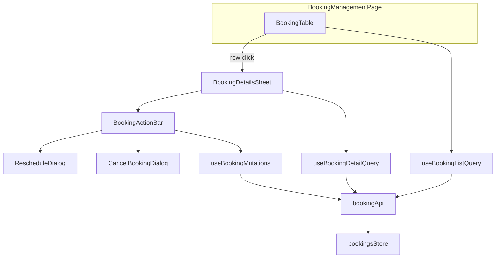

# Booking Management Module Implementation Plan

## Current state

[`src/features/booking-management/`](src/features/booking-management/) is a 7-file stub:

- [`BookingManagementPage.tsx`](src/features/booking-management/components/BookingManagementPage.tsx) — card list, no table/filters/sheet
- [`booking-management-api.ts`](src/features/booking-management/api/booking-management-api.ts) — `getBookings(merchantId?)` only, no pagination/detail/mutations
- [`types/booking.ts`](src/features/booking-management/types/booking.ts) — minimal list item; missing `no_show`, `partially_paid`, package support, detail types
- [`bookings.fixture.ts`](src/features/booking-management/api/fixtures/bookings.fixture.ts) — 6 rows

**Already wired:** route `/bookings`, permissions (`bookings:view` / `bookings:manage`), lazy load, sidebar nav, basic en/ml locale JSON.

## Architecture



**Reference modules:** [`ServiceVariantTable`](src/features/service-catalog/components/ServiceVariantTable.tsx) (paginated DataTable + filter bar), [`StaffFilters`](src/features/staff-management/components/StaffFilters.tsx) (shop select from `shopsFixture`), [`FormSheetContent`](src/shared/components/sheet/FormSheetContent.tsx) + `formSheet` tokens (details sheet), [`ConfirmWithReasonDialog`](src/shared/components/confirm-dialog/ConfirmWithReasonDialog.tsx) (cancel/no-show).

---

## Conventions (deviations from user spec where repo differs)

| User requirement            | Repo reality                         | Plan                                                                                                                                                                                                              |
| --------------------------- | ------------------------------------ | ----------------------------------------------------------------------------------------------------------------------------------------------------------------------------------------------------------------- |
| URL query-param filter sync | **No module uses `useSearchParams`** | Local filter state + TanStack Query params (same as Staff/Service Catalog). Shareable URLs are out of scope unless you want a follow-up.                                                                          |
| Toast on mutation success   | **No toast/sonner installed**        | Invalidate queries + close dialog/sheet on success (merchant [`ShopRowActions`](src/features/merchant-management/components/ShopRowActions.tsx) pattern). Show `mutation.isError` inline in dialogs where needed. |
| Date range picker component | **None shared**                      | Pair of native `<Input type="date">` in filter bar (`dateFrom` / `dateTo`), matching staff API date filtering in [`staff-management-api.ts`](src/features/staff-management/api/staff-management-api.ts).          |
| Timeline component          | **None exists**                      | Build `BookingTimeline` — simple vertical stepper with icons + timestamps in feature folder.                                                                                                                      |
| Customer autocomplete       | **No Combobox**                      | Debounced text input in filter bar (`customerSearch`) matching name **or** phone in API layer.                                                                                                                    |

---

## Phase 0 — Types and schemas

### Expand [`types/booking.ts`](src/features/booking-management/types/booking.ts)

```ts
export type BookingStatus = 'pending' | 'confirmed' | 'completed' | 'cancelled' | 'no_show';

export type PaymentStatus = 'paid' | 'pending' | 'partially_paid' | 'failed' | 'refunded';

export type BookingKind = 'service' | 'package';

export type BookingListItem = {
  id: string;
  merchantId: string;
  shopName: string;
  customerId: string;
  customerName: string;
  staffId: string;
  staffName: string;
  kind: BookingKind;
  serviceName: string; // primary label for list column
  packageName?: string; // when kind === 'package'
  status: BookingStatus;
  scheduledAt: string;
  paymentStatus: PaymentStatus;
  amount: number;
};

export type BookingListParams = ApiListParams & {
  merchantId?: string | null; // from useScope
  status?: BookingStatus;
  upcoming?: boolean; // filter: confirmed + scheduledAt > now
  shopId?: string;
  staffId?: string;
  dateFrom?: string;
  dateTo?: string;
  customerSearch?: string;
  paymentStatus?: PaymentStatus;
  sortBy?: 'scheduledAt' | 'customerName' | 'amount' | 'status';
  sortOrder?: 'asc' | 'desc';
};
```

**Status filter mapping (UI → API):**

- `confirmed` → `status=confirmed` (all confirmed, past + future)
- `upcoming` → `upcoming=true` (confirmed + `scheduledAt > now`)
- `pending`, `completed`, `cancelled`, `no_show` → direct status match
- Pending is **not** in the user's filter list but is required for Confirm workflow — include in filter dropdown for operators

### New [`types/booking-detail.ts`](src/features/booking-management/types/booking-detail.ts)

- `BookingTimelineEventType`: `'created' | 'confirmed' | 'rescheduled' | 'completed' | 'cancelled' | 'no_show'`
- `BookingTimelineEvent`: `{ type, label?, at, note? }`
- `BookingServiceInfo`: name, category, durationMinutes, price
- `BookingPackageInfo`: name, includedServices: `{ name, durationMinutes }[]`
- `BookingPaymentInfo`: amount, method, status, transactionId?
- `BookingDetail`: extends list fields + customer phone/avatarUrl?, service?, package?, specialist shop, timeline[], payment, internalNotes, customerNotes

### New [`types/booking.schema.ts`](src/features/booking-management/types/booking.schema.ts)

Zod schemas (per [`react-hook-form-zod` skill](.cursor/skills/react-hook-form-zod/SKILL.md)):

- `rescheduleBookingSchema` — `scheduledAt` (ISO datetime string from `datetime-local`)
- `cancelBookingSchema` — optional `reason` (min length when provided)
- `updateBookingNotesSchema` — `internalNotes`

Update [`types/index.ts`](src/features/booking-management/types/index.ts) barrel.

---

## Phase 1 — Fixtures and API

### Expand [`api/fixtures/bookings.fixture.ts`](src/features/booking-management/api/fixtures/bookings.fixture.ts)

- ~22 rows across `shp-001`–`shp-004`
- Cover all statuses including `no_show`, `pending`, `partially_paid`
- Link `customerId` to [`customers.fixture.ts`](src/features/user-management/api/fixtures/customers.fixture.ts) (`usr-001`…)
- Link `staffId` to [`staff.fixture.ts`](src/features/staff-management/api/fixtures/staff.fixture.ts)
- Include 2–3 **package** bookings (`kind: 'package'`)

### New [`api/fixtures/booking-details.fixture.ts`](src/features/booking-management/api/fixtures/booking-details.fixture.ts)

Full `BookingDetail` records keyed by booking id (timeline events, payment method, notes, package breakdown).

### Rewrite [`api/booking-management-api.ts`](src/features/booking-management/api/booking-management-api.ts)

In-memory mutable store (mirror [`service-catalog-api.ts`](src/features/service-catalog/api/service-catalog-api.ts)):

| Function                                    | Behavior                                                                                                                                      |
| ------------------------------------------- | --------------------------------------------------------------------------------------------------------------------------------------------- |
| `getBookings(params)`                       | Scope filter (`merchantId` from scope), combinable filters, `upcoming` computed filter, sort, paginate → `PaginatedResponse<BookingListItem>` |
| `getBookingById(id)`                        | Full detail; throw if missing                                                                                                                 |
| `confirmBooking(id)`                        | `pending → confirmed`; append timeline event                                                                                                  |
| `rescheduleBooking(id, { scheduledAt })`    | Update datetime; append `rescheduled` event                                                                                                   |
| `cancelBooking(id, { reason? })`            | `→ cancelled`; append event                                                                                                                   |
| `completeBooking(id)`                       | `confirmed → completed` (guard: scheduledAt ≤ now)                                                                                            |
| `markBookingNoShow(id, { reason? })`        | `confirmed → no_show`                                                                                                                         |
| `updateBookingNotes(id, { internalNotes })` | Patch notes                                                                                                                                   |

Use `mockDelay`, return `ApiMutationResponse` for mutations. Document future REST endpoints in file header.

---

## Phase 2 — TanStack Query hooks

Rewrite [`hooks/use-booking-management-queries.ts`](src/features/booking-management/hooks/use-booking-management-queries.ts):

```ts
// Query keys
['booking-management', 'list', params][('booking-management', 'detail', bookingId)];

// Hooks
useBookingListQuery(params); // keepPreviousData
useBookingDetailQuery(bookingId); // enabled when id truthy

// Mutations (each invalidates list + detail)
useConfirmBookingMutation(bookingId);
useRescheduleBookingMutation(bookingId);
useCancelBookingMutation(bookingId);
useCompleteBookingMutation(bookingId);
useMarkNoShowMutation(bookingId);
useUpdateBookingNotesMutation(bookingId);
```

Pass `merchantId` from `useScope()` into list params inside `BookingTable` (not inside hook — keeps hook testable).

---

## Phase 3 — List UI (Sub-module A)

### Shared tweak: [`DataTable.tsx`](src/shared/components/data-table/DataTable.tsx)

Add optional `onRowClick?: (row: TData) => void`:

- Desktop: `cursor-pointer` + `onClick` on `<tr>` (ignore clicks from action menu via `stopPropagation` in row actions)
- Mobile: wrap card in clickable container when provided

### New components under `components/`

| File                            | Responsibility                                                                                                                                                       |
| ------------------------------- | -------------------------------------------------------------------------------------------------------------------------------------------------------------------- |
| `BookingStatusBadge.tsx`        | Color-coded variants: pending=outline, confirmed=default, completed=secondary, cancelled/no_show=destructive                                                         |
| `BookingPaymentStatusBadge.tsx` | paid=default, pending/partially_paid=outline, failed/refunded=destructive                                                                                            |
| `booking-columns.tsx`           | 9 columns: Customer, Shop, Staff, Service/Package, Date & Time (`date-fns`), Status badge, Payment badge, Amount (`formatInr`), actions                              |
| `BookingFilters.tsx`            | Status, Shop (`shopsFixture`), Staff (filtered by shop via `staffFixture`), date from/to, customer search input, payment status — each with `*FilterToParam` helpers |
| `BookingMobileCard.tsx`         | Card layout per responsive skill; clickable                                                                                                                          |
| `BookingRowActions.tsx`         | ActionMenu "View details" (also stops propagation); opens sheet                                                                                                      |
| `BookingTable.tsx`              | State orchestration: pagination, filters, sorting, debounced customer search, `QuerySection` + `DataTable`, selected booking id → sheet                              |

**Filter bar layout:** `flex flex-col gap-2 sm:flex-row sm:flex-wrap` (same as [`ServiceVariantFilters`](src/features/service-catalog/components/ServiceVariantFilters.tsx)).

**Staff dependency:** when shop filter changes, reset staff filter to `all` and filter staff options by `merchantId === shopId`.

**Permissions:** actions in sheet gated by `ability.can('manage', PERMISSIONS.bookings.manage)`.

---

## Phase 4 — Details sheet (Sub-module B)

### `BookingDetailsSheet.tsx`

- Controlled by `open` + `bookingId` from `BookingTable`
- Uses `Sheet` + `FormSheetContent` with `className="sm:max-w-lg"` (wider read-only layout; still full-width below sm per `formSheet` tokens)
- Header: booking id + status badges
- Body: section components each wrapped in own `QuerySection` with section skeletons
- Footer: `BookingActionBar`

### Section components (each ~40–60 lines)

| Component                  | Content                                                                                                                                   |
| -------------------------- | ----------------------------------------------------------------------------------------------------------------------------------------- |
| `BookingCustomerSection`   | Avatar/initials ([`Avatar`](src/shared/components/ui/avatar.tsx)), name, phone, `Link` to [`userDetailPath`](src/shared/config/routes.ts) |
| `BookingServiceSection`    | Shown when `kind === 'service'`                                                                                                           |
| `BookingPackageSection`    | Shown when `kind === 'package'` — name + included services list                                                                           |
| `BookingSpecialistSection` | Staff name, avatar, shop                                                                                                                  |
| `BookingTimeline`          | Vertical stepper from `timeline[]`                                                                                                        |
| `BookingPaymentSection`    | Amount, method, status badge, transaction ref                                                                                             |
| `BookingNotesSection`      | Customer notes (read-only) + internal notes (editable textarea + Save when `canManage`)                                                   |

---

## Phase 5 — Actions (Sub-module C)

### `BookingActionBar.tsx`

Status-gated buttons (disabled + `title` tooltip when invalid):

| Status                              | Actions                                                                         |
| ----------------------------------- | ------------------------------------------------------------------------------- |
| `pending`                           | Confirm, Cancel                                                                 |
| `confirmed`                         | Reschedule, Cancel, Complete (if `scheduledAt <= now`), No Show (if past start) |
| `completed`, `cancelled`, `no_show` | None (hide bar or show read-only label)                                         |

All buttons respect `isPending` from active mutation.

### `RescheduleDialog.tsx`

- shadcn `Dialog` + react-hook-form + `rescheduleBookingSchema`
- `<Input type="datetime-local">` prefilled from current `scheduledAt`
- Submit → `useRescheduleBookingMutation`

### `CancelBookingDialog.tsx`

- Wraps `ConfirmWithReasonDialog` (optional reason, destructive variant)
- Reused for **No Show** with different copy/confirm handler

**Complete / Confirm:** use existing [`ConfirmDialog`](src/shared/components/confirm-dialog/ConfirmDialog.tsx) for non-destructive confirmations.

---

## Phase 6 — Page + i18n

### Update [`BookingManagementPage.tsx`](src/features/booking-management/components/BookingManagementPage.tsx)

Replace card list with page header (`layout.pageStack`, `typography.sectionTitle`) + `<BookingTable />`.

### Locales

Expand [`src/locales/en/booking-management.json`](src/locales/en/booking-management.json) and [`src/locales/ml/booking-management.json`](src/locales/ml/booking-management.json):

- All column headers, filter labels, status/payment labels, empty states, section titles, action labels, confirm dialog copy, pagination keys, timeline event labels

---

## Files created / modified

### New (~20 files)

```
src/features/booking-management/types/booking-detail.ts
src/features/booking-management/types/booking.schema.ts
src/features/booking-management/api/fixtures/booking-details.fixture.ts
src/features/booking-management/components/BookingTable.tsx
src/features/booking-management/components/booking-columns.tsx
src/features/booking-management/components/BookingFilters.tsx
src/features/booking-management/components/BookingStatusBadge.tsx
src/features/booking-management/components/BookingPaymentStatusBadge.tsx
src/features/booking-management/components/BookingMobileCard.tsx
src/features/booking-management/components/BookingRowActions.tsx
src/features/booking-management/components/BookingDetailsSheet.tsx
src/features/booking-management/components/BookingCustomerSection.tsx
src/features/booking-management/components/BookingServiceSection.tsx
src/features/booking-management/components/BookingPackageSection.tsx
src/features/booking-management/components/BookingSpecialistSection.tsx
src/features/booking-management/components/BookingTimeline.tsx
src/features/booking-management/components/BookingPaymentSection.tsx
src/features/booking-management/components/BookingNotesSection.tsx
src/features/booking-management/components/BookingActionBar.tsx
src/features/booking-management/components/RescheduleDialog.tsx
src/features/booking-management/components/CancelBookingDialog.tsx
```

### Modified (~8 files)

```
src/features/booking-management/types/booking.ts
src/features/booking-management/types/index.ts
src/features/booking-management/api/fixtures/bookings.fixture.ts
src/features/booking-management/api/booking-management-api.ts
src/features/booking-management/hooks/use-booking-management-queries.ts
src/features/booking-management/components/BookingManagementPage.tsx
src/shared/components/data-table/DataTable.tsx
src/locales/en/booking-management.json
src/locales/ml/booking-management.json
```

[`index.ts`](src/features/booking-management/index.ts) unchanged (exports page only).

---

## Verification

```bash
pnpm exec tsc --noEmit
pnpm build
```

Manual smoke: `/bookings` — filter combinations, pagination, row click → sheet, each action from a fixture row in the right status, mobile card view below md, scope filter via admin shop selector.
