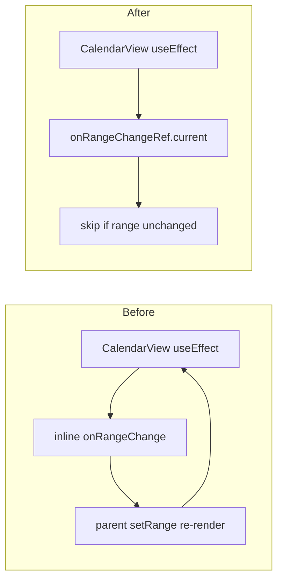

# Fix Calendar Infinite Loop + Input Reset

## Root cause analysis

Two separate bugs, both triggered by **unstable references recreated every render**:

### 1. Primary: `CalendarView` range effect loop (Maximum update depth)

[`CalendarView.tsx`](src/features/calendar-scheduling/components/calendar/CalendarView.tsx) lines 72–75:

```tsx
useEffect(() => {
  const range = getVisibleRange(internalDate, effectiveView);
  onRangeChange(range.start, range.end);
}, [internalDate, effectiveView, onRangeChange]);
```

Every tab passes an **inline** callback:

```tsx
onRangeChange={(start, end) => setRange({ start, end })}
```

(in [`ShopCalendarTab.tsx`](src/features/calendar-scheduling/components/shop/ShopCalendarTab.tsx), [`StaffCalendarTab.tsx`](src/features/calendar-scheduling/components/staff/StaffCalendarTab.tsx), [`HolidayCalendarTab.tsx`](src/features/calendar-scheduling/components/holidays/HolidayCalendarTab.tsx), [`BlockedSlotsTab.tsx`](src/features/calendar-scheduling/components/blocked-slots/BlockedSlotsTab.tsx))

**Loop:** effect runs → `setRange` in parent → parent re-renders → new `onRangeChange` reference → effect runs again → infinite loop.

[`calendar-theme.ts`](src/features/calendar-scheduling/lib/calendar-theme.ts) and [`to-kit-event.ts`](src/features/calendar-scheduling/lib/adapters/to-kit-event.ts) are **not** the cause — theme is already wrapped in `useMemo`; kit events are memoized on `[events, calendarIdMode]`.

---

### 2. Secondary: RHF form reset on every keystroke

**A) [`ManualBookingSheet.tsx`](src/features/calendar-scheduling/components/ManualBookingSheet.tsx) lines 65–78**

```tsx
useEffect(() => {
  if (open) form.reset({ ... });
}, [open, shopId, defaultStart, defaultStaffId, form, staffOptions]);
```

- `staffOptions = staffFixture.filter(...)` — **new array every render**
- `form` — unstable RHF object reference
- While sheet is open, any parent re-render (from loop #1 or query refetch) re-runs `form.reset()` → **input clears on every keystroke**

**B) Inline `values` objects in `useForm` config** (RHF controlled mode re-syncs when `values` reference changes):

| File                                                                                                             | Line                                    |
| ---------------------------------------------------------------------------------------------------------------- | --------------------------------------- |
| [`BlockedSlotFormSheet.tsx`](src/features/calendar-scheduling/components/blocked-slots/BlockedSlotFormSheet.tsx) | `values: slot ? { ... } : undefined`    |
| [`HolidayFormSheet.tsx`](src/features/calendar-scheduling/components/holidays/HolidayFormSheet.tsx)              | `values: holiday ? { ... } : undefined` |
| [`RecurringPatternEditor.tsx`](src/features/calendar-scheduling/components/recurring/RecurringPatternEditor.tsx) | `values: pattern ? { ... } : undefined` |

Parent re-renders → new object literal → RHF resets fields.

---

## Fix strategy



### Fix 1 — `CalendarView.tsx` (stop the loop at source)

- Store `onRangeChange` in a `useRef`, update ref each render (no effect dep on callback)
- Effect deps: `[internalDate, effectiveView]` only
- Guard with a ref holding last emitted `{ start, end }` — skip call if unchanged (prevents redundant parent updates even with stable callback)

```tsx
const onRangeChangeRef = useRef(onRangeChange);
onRangeChangeRef.current = onRangeChange;
const lastRangeRef = useRef<{ start: string; end: string } | null>(null);

useEffect(() => {
  const range = getVisibleRange(internalDate, effectiveView);
  if (
    lastRangeRef.current?.start === range.start &&
    lastRangeRef.current?.end === range.end
  )
    return;
  lastRangeRef.current = range;
  onRangeChangeRef.current(range.start, range.end);
}, [internalDate, effectiveView]);
```

### Fix 2 — Tab components (defensive stabilization)

In all 4 tabs using `CalendarView`, replace inline handler with `useCallback`:

```tsx
const handleRangeChange = useCallback((start: string, end: string) => {
  setRange((prev) =>
    prev.start === start && prev.end === end ? prev : { start, end },
  );
}, []);
```

Also memoize `buildShopCalendars()` in [`ShopCalendarTab.tsx`](src/features/calendar-scheduling/components/shop/ShopCalendarTab.tsx) (`useMemo(() => buildShopCalendars(), [])`) to avoid new `calendars` array every render passed into BasicScheduler.

### Fix 3 — `ManualBookingSheet.tsx`

- Memoize staff list: `useMemo(() => staffFixture.filter(...), [shopId])`
- Narrow reset effect deps to **`[open, shopId, defaultStart, defaultStaffId]`** only — remove `form` and `staffOptions`
- Reset only when sheet opens (track prior `open` with ref, or `if (!open) return` at top and depend on open flip)

```tsx
useEffect(() => {
  if (!open) return;
  form.reset({ shopId, ... });
}, [open, shopId, defaultStart, defaultStaffId]); // form.reset is stable enough; omit `form` from deps
```

### Fix 4 — Form sheets with inline `values`

Replace inline `values:` object with `useMemo` keyed on entity id + open:

**BlockedSlotFormSheet** — memoize on `slot?.id`, `slot?.start`, etc. or reset via effect when `open && slot?.id` changes.

**HolidayFormSheet** — same pattern on `holiday?.id`.

**RecurringPatternEditor** — same on `pattern?.id`; memoize `staffOptions` too.

Preferred pattern (matches project convention):

```tsx
const editValues = useMemo(
  () => slot ? { scope: slot.scope, ... } : undefined,
  [slot?.id, slot?.scope, slot?.start, slot?.end, slot?.reason, slot?.staffId],
);
const form = useForm({ defaultValues: ..., values: editValues });
```

For create mode (`slot` undefined), omit `values` entirely — use `defaultValues` + reset-on-open only.

---

## Files to change

| File                                                                                                             | Change                                         |
| ---------------------------------------------------------------------------------------------------------------- | ---------------------------------------------- |
| [`CalendarView.tsx`](src/features/calendar-scheduling/components/calendar/CalendarView.tsx)                      | Ref-based `onRangeChange` + range dedup guard  |
| [`ShopCalendarTab.tsx`](src/features/calendar-scheduling/components/shop/ShopCalendarTab.tsx)                    | `useCallback` range handler; memoize calendars |
| [`StaffCalendarTab.tsx`](src/features/calendar-scheduling/components/staff/StaffCalendarTab.tsx)                 | `useCallback` range handler                    |
| [`HolidayCalendarTab.tsx`](src/features/calendar-scheduling/components/holidays/HolidayCalendarTab.tsx)          | `useCallback` range handler                    |
| [`BlockedSlotsTab.tsx`](src/features/calendar-scheduling/components/blocked-slots/BlockedSlotsTab.tsx)           | `useCallback` range handler                    |
| [`ManualBookingSheet.tsx`](src/features/calendar-scheduling/components/ManualBookingSheet.tsx)                   | Memoize staffOptions; narrow reset effect deps |
| [`BlockedSlotFormSheet.tsx`](src/features/calendar-scheduling/components/blocked-slots/BlockedSlotFormSheet.tsx) | Memoize `values` or reset-on-open              |
| [`HolidayFormSheet.tsx`](src/features/calendar-scheduling/components/holidays/HolidayFormSheet.tsx)              | Memoize `values` or reset-on-open              |
| [`RecurringPatternEditor.tsx`](src/features/calendar-scheduling/components/recurring/RecurringPatternEditor.tsx) | Memoize `values`; memoize staffOptions         |

**No changes** to `calendar-theme.ts`, adapters, or query hooks.

---

## Verification

```bash
pnpm exec tsc --noEmit
```

Manual smoke at `/calendar`:

- Calendar renders without console "Maximum update depth exceeded"
- Open Manual Booking sheet → type in customer name → value persists
- Edit blocked slot / holiday / recurring pattern → typing does not reset fields
- Navigate month/week/day → query range still updates correctly
