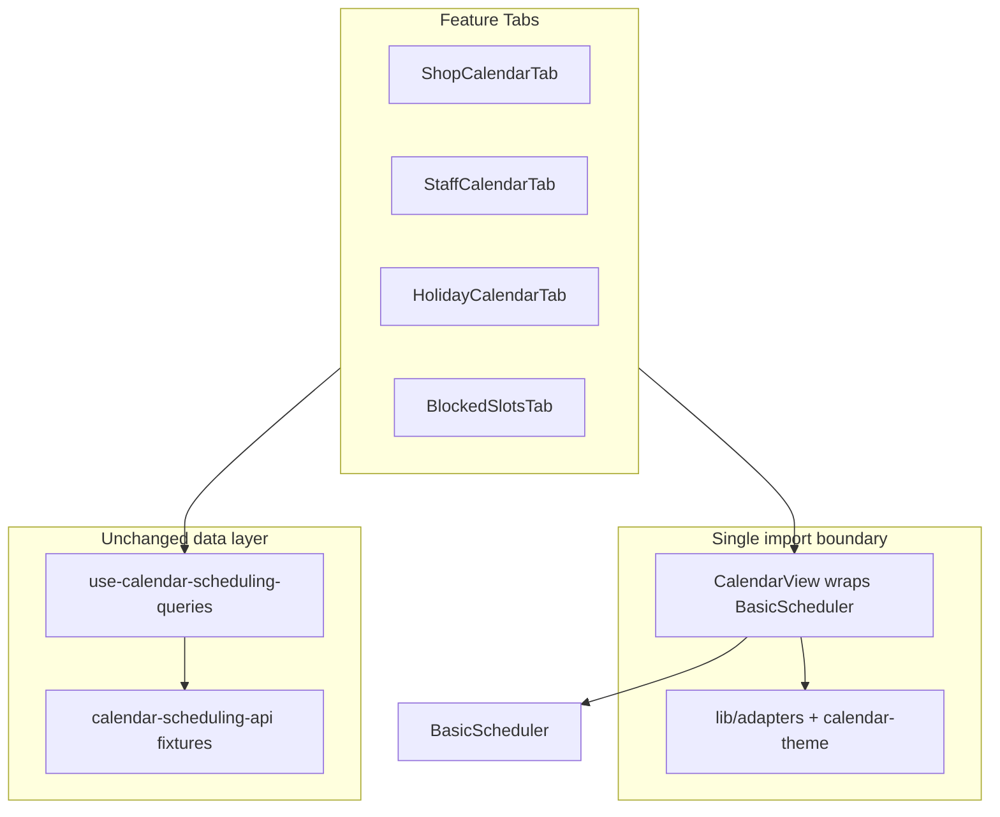

# CalendarKit Basic Migration Plan

## Current state

The module is **fully implemented on FullCalendar 6.1.21** (~40 files under [`src/features/calendar-scheduling/`](src/features/calendar-scheduling/)). The only direct FullCalendar import is [`CalendarView.tsx`](src/features/calendar-scheduling/components/calendar/CalendarView.tsx); all tabs consume it via props.

**Dependencies to remove** (7 packages in [`package.json`](package.json)):
`@fullcalendar/core`, `daygrid`, `interaction`, `list`, `react`, `resource-timeline`, `timegrid`

**Dependency to add:**

```bash
pnpm add calendarkit-basic --save-exact
```

Also update [`VERSIONS.md`](VERSIONS.md), [`.cursor/rules/090-calendar-scheduling.mdc`](.cursor/rules/090-calendar-scheduling.mdc), and [`.cursor/rules/000-project-context.mdc`](.cursor/rules/000-project-context.mdc) to reference CalendarKit Basic instead of FullCalendar.

---

## Architecture after migration



**Rule:** Only [`CalendarView.tsx`](src/features/calendar-scheduling/components/calendar/CalendarView.tsx) imports `calendarkit-basic`. Feature tabs never import `BasicScheduler` directly.

---

## Phase 0 — Dependency swap

1. `pnpm remove @fullcalendar/core @fullcalendar/daygrid @fullcalendar/interaction @fullcalendar/list @fullcalendar/react @fullcalendar/resource-timeline @fullcalendar/timegrid`
2. `pnpm add calendarkit-basic --save-exact`
3. Delete [`calendar-fullcalendar.css`](src/features/calendar-scheduling/components/calendar/calendar-fullcalendar.css)
4. Verify no remaining `@fullcalendar` imports (`grep` across repo)

---

## Phase 1 — Types and adapters

### Rename domain vs library types

Current [`calendar-event.ts`](src/features/calendar-scheduling/types/calendar-event.ts) uses ISO strings + `extendedProps`. CalendarKit requires `start`/`end` as `Date`.

| Layer   | Type                                                                                             | Location                  |
| ------- | ------------------------------------------------------------------------------------------------ | ------------------------- |
| Library | `import type { CalendarEvent as KitCalendarEvent, ViewType, Calendar } from 'calendarkit-basic'` | wrapper only              |
| Domain  | `ScheduleEvent` (keep kind, entityId, bookingStatus, etc.)                                       | `types/schedule-event.ts` |
| Bridge  | `KitCalendarEvent & { meta: ScheduleEventMeta }` stored in wrapper lookup map                    | adapter output            |

**New files:**

- [`lib/adapters/to-kit-event.ts`](src/features/calendar-scheduling/lib/adapters/to-kit-event.ts) — map domain records → `KitCalendarEvent` (`calendarId`, `color`, `Date` start/end)
- [`lib/adapters/from-kit-event.ts`](src/features/calendar-scheduling/lib/adapters/from-kit-event.ts) — reverse lookup via `id` → `ScheduleEventMeta`
- [`lib/calendar-calendars.ts`](src/features/calendar-scheduling/lib/calendar-calendars.ts) — `Calendar[]` definitions (id, label, color, active) for legend + filtering
- [`lib/calendar-theme.ts`](src/features/calendar-scheduling/lib/calendar-theme.ts) — map shadcn CSS vars (`--primary`, `--background`, etc. from [`globals.css`](src/styles/globals.css)) to `CalendarTheme`; react to `.dark` class via `useTheme()` or `matchMedia`
- [`lib/materialize-holidays.ts`](src/features/calendar-scheduling/lib/materialize-holidays.ts) — expand `recurringYearly` holidays into concrete date ranges per visible year (no RRULE)

**Update existing mappers:**

- [`map-booking-to-event.ts`](src/features/calendar-scheduling/lib/map-booking-to-event.ts) → returns domain event, then adapter adds `calendarId: 'booking-{status}'` and status color
- [`calendar-scheduling-api.ts`](src/features/calendar-scheduling/api/calendar-scheduling-api.ts) — call `materializeHoliday()` inside `holidayToEvent()` when `recurringYearly: true`; keep fixture stores unchanged

**View type change:**

- Replace `CalendarViewMode` (`month | week | day | agenda | resourceTimeline`) with `ViewType` from library (`month | week | day` only)
- Mobile fallback: **day view** below `breakpoints.md` (replaces forced agenda — Basic has no list/agenda view)

**Week start:** `weekStartsOn={1}` (Monday, ISO/EU — no existing `startOfWeek` usage in codebase; India business convention)

---

## Phase 2 — Rewrite CalendarView wrapper

Replace [`CalendarView.tsx`](src/features/calendar-scheduling/components/calendar/CalendarView.tsx) entirely:

```tsx
// Only file importing calendarkit-basic
import { BasicScheduler, EmptyState } from "calendarkit-basic";
```

**Wrapper props** (project-facing, mirrors BasicScheduler + domain extras):

| Prop                              | Purpose                                                            |
| --------------------------------- | ------------------------------------------------------------------ |
| `events: ScheduleEvent[]`         | Domain events from TanStack Query                                  |
| `calendars?: Calendar[]`          | Filter toggles (staff tab)                                         |
| `view` / `onViewChange`           | month/week/day                                                     |
| `date` / `onDateChange`           | drives query range via `onRangeChange` callback                    |
| `onEventClick`                    | domain event click                                                 |
| `onEventCreate`                   | empty-slot / FAB create                                            |
| `onEventUpdate` / `onEventDelete` | form-driven edits                                                  |
| `onCalendarToggle`                | staff filter                                                       |
| `readOnly`                        | `!canManage`                                                       |
| `isLoading`                       | `isPending \|\| isFetching`                                        |
| `renderEvent`                     | status-colored booking/blocked/holiday chips                       |
| `renderEventForm`                 | delegate to tab-specific RHF forms                                 |
| `emptyState`                      | contextual `EmptyState` props when events.length === 0 && !loading |

**Remove from wrapper API:** `onEventDrop`, `resources`, `showResourceView`, `editable`, `selectable`, `onDateSelect` (replaced by `onEventCreate` with `initialDate` from library)

**Delete or gut:**

- [`CalendarHeader.tsx`](src/features/calendar-scheduling/components/calendar/CalendarHeader.tsx) — BasicScheduler includes prev/next/today + view switcher; remove custom header unless i18n gap requires thin locale wrapper
- [`CalendarSkeleton.tsx`](src/features/calendar-scheduling/components/calendar/CalendarSkeleton.tsx) — replace with `isLoading` prop on BasicScheduler (library provides `CalendarSkeleton` / view-specific skeletons internally)

**Keep and refactor:**

- [`CalendarLegend.tsx`](src/features/calendar-scheduling/components/calendar/CalendarLegend.tsx) — render from `calendars` prop labels/colors instead of CSS class legend
- [`calendar-event-colors.ts`](src/features/calendar-scheduling/components/calendar/calendar-event-colors.ts) → move hex/status colors into `calendar-calendars.ts`; used by `renderEvent`

**New shared render helper:**

- [`components/calendar/CalendarEventRenderer.tsx`](src/features/calendar-scheduling/components/calendar/CalendarEventRenderer.tsx) — shared `renderEvent` implementation (booking status badge, blocked stripe, holiday all-day chip)

---

## Phase 3 — Hooks adjustments

[`use-calendar-scheduling-queries.ts`](src/features/calendar-scheduling/hooks/use-calendar-scheduling-queries.ts):

- **Remove** optimistic `useMoveCalendarEventMutation` drag-drop logic (or reduce to internal helper called from form submit only — no UI drag path)
- **Keep** `useRescheduleBookingMutation` from [`booking-management`](src/features/booking-management/hooks/use-booking-management-queries.ts) — wire via [`RescheduleDialog`](src/features/booking-management/components/RescheduleDialog.tsx) opened from `BookingDetailsSheet` (already exists)
- All create/update/delete continue through existing mutation hooks; UI callbacks call mutations then invalidate `['calendar-scheduling', ...]`

---

## Phase 4 — Tab rewrites

### Shop Calendar — [`ShopCalendarTab.tsx`](src/features/calendar-scheduling/components/shop/ShopCalendarTab.tsx)

| Before (FullCalendar)                | After (Basic)                                                                                                                        |
| ------------------------------------ | ------------------------------------------------------------------------------------------------------------------------------------ |
| `onEventDrop` → drag reschedule      | **Removed** — reschedule via BookingDetailsSheet → RescheduleDialog                                                                  |
| `onDateSelect` → ManualBookingSheet  | `onEventCreate` → open [`ManualBookingSheet`](src/features/calendar-scheduling/components/ManualBookingSheet.tsx) with `initialDate` |
| Custom skeleton in QuerySection      | `isLoading={isPending \|\| isFetching}` on CalendarView; library EmptyState when no bookings                                         |
| `onEventClick` → BookingDetailsSheet | unchanged                                                                                                                            |
| Status colors via CSS classes        | `renderEvent` + `calendarId: 'booking-{status}'`                                                                                     |

### Staff Calendar — [`StaffCalendarTab.tsx`](src/features/calendar-scheduling/components/staff/StaffCalendarTab.tsx)

| Before                                     | After                                                                                              |
| ------------------------------------------ | -------------------------------------------------------------------------------------------------- |
| Default `resourceTimeline` + `resources[]` | Default **`week`** view                                                                            |
| Staff rows in timeline                     | **`calendars` prop**: one entry per staff (`id: staffId`, label: name, color) + `onCalendarToggle` |
| Drag reschedule                            | Click booking → BookingDetailsSheet → RescheduleDialog                                             |

> **Known gap (document in code comment + summary):** No side-by-side resource/timeline view in Basic. Staff scheduling uses week view + calendar filter toggles. Pro upgrade would restore `resource` view + drag-drop.

### Holiday Calendar — [`HolidayCalendarTab.tsx`](src/features/calendar-scheduling/components/holidays/HolidayCalendarTab.tsx)

- Calendar sub-tab: CalendarView with `calendarId: 'holiday'`, `allDay: true`, distinct color
- List sub-tab: keep existing list UI (no DataTable required)
- Add/edit: keep [`HolidayFormSheet`](src/features/calendar-scheduling/components/holidays/HolidayFormSheet.tsx) (RHF + Zod); optionally wire as `renderEventForm` or keep as external sheet triggered by `onEventCreate`/`onEventClick`
- `recurringYearly`: materialize in [`materialize-holidays.ts`](src/features/calendar-scheduling/lib/materialize-holidays.ts) when building events for visible range — **not** library RRULE
- Conflict check: keep `checkHolidayConflicts` pre-submit in form (unchanged)

### Blocked Slots — [`BlockedSlotsTab.tsx`](src/features/calendar-scheduling/components/blocked-slots/BlockedSlotsTab.tsx)

| Before                         | After                                                                                                                          |
| ------------------------------ | ------------------------------------------------------------------------------------------------------------------------------ |
| Drag-create via `onDateSelect` | `onEventCreate` → [`BlockedSlotFormSheet`](src/features/calendar-scheduling/components/blocked-slots/BlockedSlotFormSheet.tsx) |
| Drag-resize via `onEventDrop`  | `onEventClick` → edit sheet; datetime changed in form → `useUpdateBlockedSlotMutation`                                         |
| Side panel list                | unchanged                                                                                                                      |

`calendarId: 'blocked'`; scope via `calendarId` = shop-wide `'blocked-shop'` or staff-specific `'blocked-{staffId}'`

### Working Hours — [`WorkingHoursTab.tsx`](src/features/calendar-scheduling/components/working-hours/WorkingHoursTab.tsx)

- **No calendar library** — keep standalone [`ShopWorkingHoursEditor`](src/features/merchant-management/components/ShopWorkingHoursEditor.tsx) / [`StaffWorkingHoursEditor`](src/features/staff-management/components/StaffWorkingHoursTab.tsx)
- Optional stretch: materialize working-hour ranges as read-only overlay events on Shop/Staff calendar tabs (`readOnly` + muted `renderEvent`) — defer if time-constrained

### Recurring Availability — [`RecurringAvailabilityTab.tsx`](src/features/calendar-scheduling/components/recurring/RecurringAvailabilityTab.tsx)

- Keep custom pattern editor (already non-calendar)
- Visualization: existing `recurringToEvents()` in API already materializes occurrences — pass as read-only overlay on Staff calendar tab with `readOnly` calendars entry `recurring`

### Bulk Update — [`BulkScheduleUpdateTab.tsx`](src/features/calendar-scheduling/components/bulk/BulkScheduleUpdateTab.tsx)

- **No changes** to calendar library usage (form-only)
- Ensure `applyBulkSchedule` mutation invalidates calendar query keys (already does via `invalidateCalendar`)

---

## Phase 5 — i18n and docs

Update [`src/locales/en/calendar-scheduling.json`](src/locales/en/calendar-scheduling.json) and [`ml`](src/locales/ml/calendar-scheduling.json):

- Remove `views.agenda`, `views.resourceTimeline`
- Add copy for staff-filter UX, click-to-reschedule hint, empty-state CTAs per tab
- Add limitation note keys if shown in UI tooltips

---

## Phase 6 — Verification

```bash
pnpm exec tsc --noEmit
pnpm build
```

Manual smoke at `/calendar`:

- Shop month/week/day views, booking click → details sheet, empty slot → manual booking
- Staff week view + staff calendar toggles
- Holiday list/calendar toggle, yearly holiday appears in range
- Blocked slot create/edit via form (no drag)
- Working hours save
- Mobile: day view fallback + swipe navigation

---

## Pro-only features — gaps and workarounds

| Original spec feature          | Basic support | Workaround                                                                                     |
| ------------------------------ | ------------- | ---------------------------------------------------------------------------------------------- |
| Drag-to-reschedule bookings    | Pro only      | Click event → BookingDetailsSheet → RescheduleDialog (datetime form)                           |
| Drag-resize blocked slots      | Pro only      | Edit via BlockedSlotFormSheet datetime fields                                                  |
| Resource / timeline staff view | Pro only      | Week view + `calendars` filter (one toggle per staff)                                          |
| Agenda / list calendar view    | Pro only      | Day view on mobile; Holiday tab keeps separate list UI                                         |
| Native RRULE recurrence        | Pro only      | Server-side / util materialization (`materialize-holidays.ts`, existing `recurringToEvents()`) |
| Timezone switching             | Pro only      | ISO UTC storage + browser local display (unchanged)                                            |
| ICS import/export              | Pro only      | Out of scope (unchanged)                                                                       |
| Context menus                  | Pro only      | Click → sheet/dialog actions                                                                   |

---

## Files summary

### Create (~8)

- `src/features/calendar-scheduling/lib/adapters/to-kit-event.ts`
- `src/features/calendar-scheduling/lib/adapters/from-kit-event.ts`
- `src/features/calendar-scheduling/lib/calendar-calendars.ts`
- `src/features/calendar-scheduling/lib/calendar-theme.ts`
- `src/features/calendar-scheduling/lib/materialize-holidays.ts`
- `src/features/calendar-scheduling/types/schedule-event.ts`
- `src/features/calendar-scheduling/components/calendar/CalendarEventRenderer.tsx`

### Modify (~20)

- `package.json`, `pnpm-lock.yaml`, `VERSIONS.md`
- `.cursor/rules/090-calendar-scheduling.mdc`, `.cursor/rules/000-project-context.mdc`
- `src/features/calendar-scheduling/components/calendar/CalendarView.tsx` (full rewrite)
- `CalendarLegend.tsx`, `calendar-event-colors.ts`
- All 7 tab components + `CalendarSchedulingTabs.tsx`
- `types/calendar-event.ts` (narrow view modes / deprecate FC-specific fields)
- `types/index.ts`
- `lib/map-booking-to-event.ts`
- `api/calendar-scheduling-api.ts` (yearly holiday materialization)
- `hooks/use-calendar-scheduling-queries.ts` (remove drag-drop optimistic path)
- `src/locales/en/calendar-scheduling.json`, `src/locales/ml/calendar-scheduling.json`

### Delete (~3)

- `src/features/calendar-scheduling/components/calendar/calendar-fullcalendar.css`
- `src/features/calendar-scheduling/components/calendar/CalendarHeader.tsx` (if redundant after BasicScheduler built-in chrome)
- `src/features/calendar-scheduling/components/calendar/CalendarSkeleton.tsx` (replaced by library `isLoading`)

### Unchanged

- Page shell, tabs wiring, fixture API stores, Working Hours editors, Bulk tab form, ManualBookingSheet, HolidayFormSheet, BlockedSlotFormSheet, booking-management extensions
