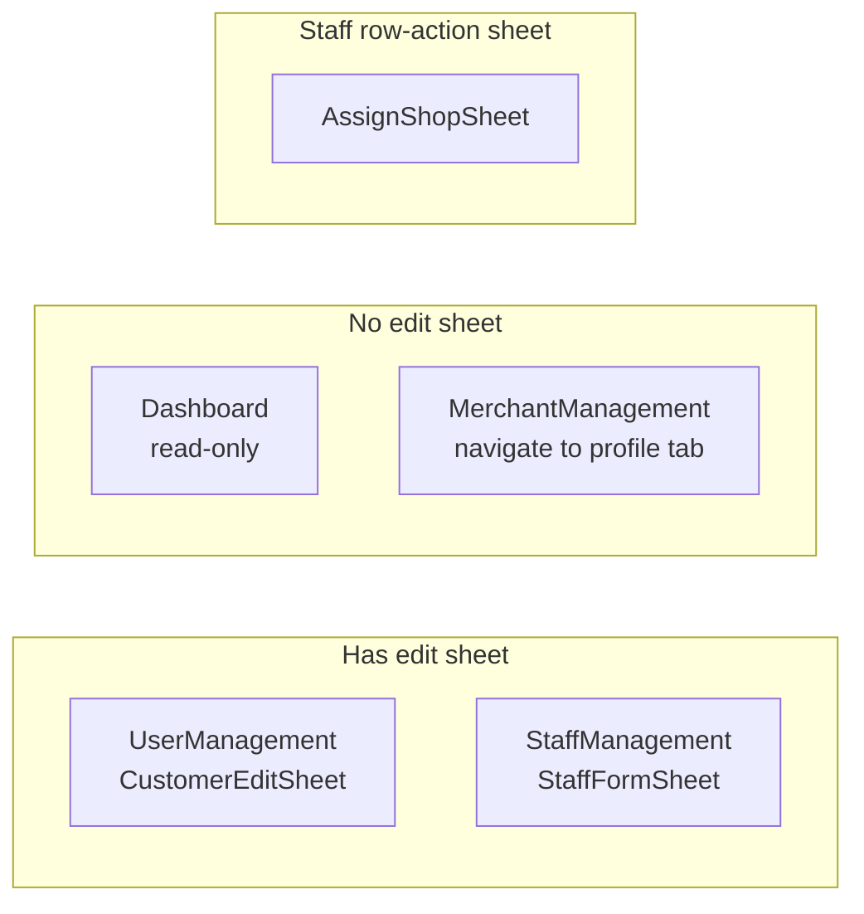

# Edit Row Side Sheet — Responsive Audit Report

## Reference standards read

- [`.cursor/rules/responsive.mdc`](.cursor/rules/responsive.mdc) — breakpoints, spacing scale, no fixed px widths, theme z-index, mobile drawer rule
- [`.cursor/skills/dashboard-responsive/SKILL.md`](.cursor/skills/dashboard-responsive/SKILL.md) — `useResponsive()`, theme tokens from [`src/theme/responsive.ts`](src/theme/responsive.ts), AppShell Sheet drawer as nav reference
- Base UI: [`src/shared/components/ui/sheet.tsx`](src/shared/components/ui/sheet.tsx)
- Reference implementation (nav drawer): [`src/shared/components/layout/AppShell.tsx`](src/shared/components/layout/AppShell.tsx) lines 80–96

**Important clarification:** Row-edit forms all use **`side="right"`**, not left. The only **left** sheet in the app is the **mobile navigation drawer** in AppShell. Your example [`StaffFormSheet.tsx`](src/features/staff-management/components/StaffFormSheet.tsx) is a **right-side** panel.

---

## Modules with the edit-row sheet pattern

| Module                  | Sheet component(s)                                                                       | Trigger                                                                                                                                                                                        | Notes                                                                                                                                     |
| ----------------------- | ---------------------------------------------------------------------------------------- | ---------------------------------------------------------------------------------------------------------------------------------------------------------------------------------------------- | ----------------------------------------------------------------------------------------------------------------------------------------- |
| **Dashboard**           | None                                                                                     | —                                                                                                                                                                                              | Read-only KPIs/charts/tables; no `Sheet` usage                                                                                            |
| **User Management**     | [`CustomerEditSheet.tsx`](src/features/user-management/components/CustomerEditSheet.tsx) | Row action "Edit" in [`CustomerRowActions.tsx`](src/features/user-management/components/CustomerRowActions.tsx)                                                                                | Edit only (3 fields)                                                                                                                      |
| **Merchant Management** | None                                                                                     | Row action "Edit" navigates to profile                                                                                                                                                         | Edit is inline on [`ShopGeneralInfoTab.tsx`](src/features/merchant-management/components/ShopGeneralInfoTab.tsx) (Card form), not a sheet |
| **Staff Management**    | [`StaffFormSheet.tsx`](src/features/staff-management/components/StaffFormSheet.tsx)      | Edit via [`StaffRowActions.tsx`](src/features/staff-management/components/StaffRowActions.tsx); Create via [`StaffTable.tsx`](src/features/staff-management/components/StaffTable.tsx) toolbar | 7 fields (create), 6 fields (edit)                                                                                                        |
| **Staff Management**    | [`AssignShopSheet.tsx`](src/features/staff-management/components/AssignShopSheet.tsx)    | Row action "Assign shop"                                                                                                                                                                       | Related row-action sheet (not edit, but same pattern)                                                                                     |



---

## Cross-cutting violations (all form sheets + base `sheet.tsx`)

These apply to every instance unless noted.

### 1. No shared form-sheet layout token (SKILL + responsive.mdc)

**What's wrong:** Each sheet duplicates `className="w-full sm:max-w-md"` (and Staff adds `overflow-y-auto`). There is no `formSheet` / `drawerForm` entry in [`src/theme/responsive.ts`](src/theme/responsive.ts).

**Rule broken:** dashboard-responsive SKILL step 1 ("check theme tokens first") and responsive.mdc enforcement ("add to theme first, don't solve locally").

### 2. z-index bypasses theme token (responsive.mdc)

**What's wrong:** [`sheet.tsx`](src/shared/components/ui/sheet.tsx) hardcodes `z-50` on overlay and content. AppShell mobile nav explicitly uses `zIndex.drawer` from theme.

**Rule broken:** responsive.mdc — "Sticky headers/toolbars must include safe z-index from theme (`zIndex.stickyHeader`)"; SKILL — pull from shared theme.

**Risk:** Low today (same value `z-50`), but form sheets don't follow the established AppShell pattern and won't track if theme z-index changes.

### 3. Header / body / footer padding mismatch (responsive.mdc spacing scale)

**What's wrong:**

- `SheetHeader` ships with `p-4` (16px).
- Form bodies use `mt-6 space-y-4` with **no horizontal padding** — inputs span full sheet width while the title is inset.
- `SheetFooter` ships with `p-4`, but [`StaffFormSheet.tsx`](src/features/staff-management/components/StaffFormSheet.tsx) overrides with `className="px-0"`, removing horizontal padding and misaligning the Save button vs header.

**Rule broken:** responsive.mdc — "All spacing must come from the shared spacing scale" used **consistently**; ad-hoc `px-0` / `mt-6` overrides create inconsistent regions.

### 4. Scroll + sticky regions not aligned with AppShell reference (SKILL step 7)

**What's wrong:**

AppShell drawer structure:

```tsx
// AppShell.tsx — reference pattern
className="flex min-h-0 flex-col gap-0 overflow-hidden p-0"
SheetHeader className="shrink-0 ..."
// scrollable body in flex-1 child
```

Form sheets use flat `flex flex-col gap-4` with no `min-h-0`, no `overflow-hidden`, no `shrink-0` header, no dedicated scroll body:

| Sheet             | Scroll strategy                            | Sticky header/footer                                       |
| ----------------- | ------------------------------------------ | ---------------------------------------------------------- |
| CustomerEditSheet | None on `SheetContent`                     | No — footer inside `<form>`, not pinned                    |
| StaffFormSheet    | `overflow-y-auto` on entire `SheetContent` | No — header + footer scroll away with content              |
| AssignShopSheet   | None                                       | No — footer uses ad-hoc `mt-6` instead of layout partition |

**Rule broken:** SKILL step 7 (Sheet drawer pattern); responsive.mdc layout rule for sticky regions on scroll.

**Impact:** Staff create/edit (7 fields) on short mobile viewports — user must scroll to reach Save; header title disappears while scrolling. Customer sheet (3 fields) likely fits without clipping today, but has no overflow fallback if validation errors expand content.

### 5. Close button touch target (mobile UX)

**What's wrong:** Close button in [`sheet.tsx`](src/shared/components/ui/sheet.tsx) uses `size="icon-sm"` → **28×28px** (`size-7`).

**Rule context:** Not explicitly in responsive.mdc, but mobile affordance check requested. Below common 44px minimum touch target.

**Impact:** All sheets inheriting default close button.

### 6. Cancel affordance inconsistent

**What's wrong:**

- `AssignShopSheet` — Cancel button in footer ✓
- `CustomerEditSheet` / `StaffFormSheet` — Save only; dismiss via X or overlay only

**Impact:** Mobile users lack a large, labeled cancel action in the thumb zone (especially when footer is below scroll fold on StaffFormSheet).

### 7. Width at sm+ tablet (informational, not a hard violation)

**What's wrong (minor):** Below `sm` (<640px): `w-full` → effectively full-viewport panel ✓. At `sm+`: `max-w-md` (448px) side panel, not full-screen.

**Rule context:** Acceptable for form drawers; not the same as nav sidebar which must be full drawer on mobile. No violation if intentional side-panel on tablet+.

---

## Per-module findings

### Dashboard — no sheet pattern

**Status:** N/A — no edit-row sheet to audit.

---

### User Management — `CustomerEditSheet`

File: [`src/features/user-management/components/CustomerEditSheet.tsx`](src/features/user-management/components/CustomerEditSheet.tsx)

| Check                | Finding                                                                              |
| -------------------- | ------------------------------------------------------------------------------------ |
| Width mobile         | `w-full` ✓ full-width below sm                                                       |
| Width tablet/desktop | `sm:max-w-md` side panel                                                             |
| Padding              | Header `p-4`; form body no `px-4` — **misaligned with header**                       |
| Footer padding       | Default `SheetFooter` `p-4` ✓ (no `px-0` override)                                   |
| Scroll               | **No `overflow-y-auto` or scroll region** — content could clip if fields/errors grow |
| Sticky header/footer | **Not implemented** — footer inside form, not viewport-pinned                        |
| Overlay/z-index      | Inherits base `sheet.tsx` `z-50` — **does not use `zIndex.drawer` token**            |
| Cancel affordance    | **No Cancel button** — X/overlay only                                                |
| Hardcoded values     | Duplicated `w-full sm:max-w-md` — **no theme token**                                 |
| Field cutoff         | 3 fields unlikely to clip on mobile; Select N/A                                      |

**Specific violations:** #1, #2, #3, #4, #5, #6 (cross-cutting).

---

### Merchant Management — no edit sheet

**Status:** Edit row action in [`ShopRowActions.tsx`](src/features/merchant-management/components/ShopRowActions.tsx) calls `navigate(shopDetailPath(id))` — edits happen on profile [`ShopGeneralInfoTab.tsx`](src/features/merchant-management/components/ShopGeneralInfoTab.tsx) inside a `Card`, not a sheet.

**Product consistency gap (not a responsive violation):** User/Staff modules use side sheets for row edit; Merchant uses full-page profile form. Out of scope for sheet responsive fixes unless you want Merchant to adopt the same sheet pattern later.

---

### Staff Management — `StaffFormSheet`

File: [`src/features/staff-management/components/StaffFormSheet.tsx`](src/features/staff-management/components/StaffFormSheet.tsx)

| Check                | Finding                                                                                       |
| -------------------- | --------------------------------------------------------------------------------------------- |
| Width mobile         | `w-full` ✓                                                                                    |
| Width tablet/desktop | `sm:max-w-md`                                                                                 |
| Padding              | Header `p-4`; form `mt-6 space-y-4` no horizontal pad — **misaligned**                        |
| Footer padding       | **`SheetFooter className="px-0"`** strips horizontal padding — **breaks spacing consistency** |
| Scroll               | `overflow-y-auto` on whole `SheetContent` — scrolls header too                                |
| Sticky header/footer | **Not implemented** — Save button scrolls off-screen on short viewports with keyboard open    |
| Overlay/z-index      | Inherits hardcoded `z-50`                                                                     |
| Cancel affordance    | **No Cancel button**                                                                          |
| Hardcoded values     | `overflow-y-auto`, `mt-6`, `px-0` — local overrides, no theme token                           |
| Field cutoff         | 7 fields + 3 selects — **highest risk module** for scroll/footer reachability on mobile       |

**Specific violations:** #1–#6; **worst offender** on padding (`px-0`) and scroll layout.

---

### Staff Management — `AssignShopSheet`

File: [`src/features/staff-management/components/AssignShopSheet.tsx`](src/features/staff-management/components/AssignShopSheet.tsx)

| Check        | Finding                                                                                                                               |
| ------------ | ------------------------------------------------------------------------------------------------------------------------------------- |
| Width mobile | `w-full` ✓                                                                                                                            |
| Padding      | Same header/body mismatch as above                                                                                                    |
| Footer       | `SheetFooter className="mt-6"` — **ad-hoc spacing** instead of `mt-auto` + scroll partition; duplicates gap with SheetContent `gap-4` |
| Scroll       | Not needed for 1 select today                                                                                                         |
| Cancel       | **Has Cancel button** ✓ (best footer affordance of the three)                                                                         |
| Structure    | Footer is sibling to body div, not inside scroll container — **inconsistent with intended SheetFooter `mt-auto` pattern**             |

**Specific violations:** #1, #2, #3, #4 (structure), #5.

---

## Summary scorecard

| Module              | Has edit sheet?           | Violation count                               | Severity |
| ------------------- | ------------------------- | --------------------------------------------- | -------- |
| Dashboard           | No                        | —                                             | —        |
| User Management     | Yes (1)                   | 6 cross-cutting                               | Medium   |
| Merchant Management | No (navigates to profile) | —                                             | —        |
| Staff Management    | Yes (2 sheets)            | StaffFormSheet: high; AssignShopSheet: medium | High     |

---

## Proposed fix phase (after your review — not started)

Fixes will be **module-by-module**, strictly using existing tokens. Recommended order:

1. **Theme first** — Add `formSheet` tokens to [`src/theme/responsive.ts`](src/theme/responsive.ts) (content width classes, body padding `px-4`, scroll body `min-h-0 flex-1 overflow-y-auto`, sticky header/footer classes mirroring AppShell). Document in dashboard-responsive SKILL.

2. **Shared wrapper (optional but preferred)** — Extract `FormSheetContent` in `src/shared/components/` composing `Sheet` + partitioned header/body/footer layout so modules don't duplicate structure. Uses theme tokens only.

3. **User Management** — Refactor [`CustomerEditSheet.tsx`](src/features/user-management/components/CustomerEditSheet.tsx): apply shared layout, add Cancel button, remove duplicated width classes.

4. **Staff Management** — Refactor [`StaffFormSheet.tsx`](src/features/staff-management/components/StaffFormSheet.tsx) and [`AssignShopSheet.tsx`](src/features/staff-management/components/AssignShopSheet.tsx): remove `px-0` / ad-hoc `mt-6`, apply scroll partition, add Cancel to StaffFormSheet.

5. **Base sheet (if approved)** — Consider bumping close button to `size="icon"` (32px) or adding hit-area padding in [`sheet.tsx`](src/shared/components/ui/sheet.tsx) without new breakpoint values.

**Out of scope unless requested:** Merchant Management sheet adoption; Dashboard (no sheets).

**Verification after fixes:** Manual check at 375px, 640px, 768px, 1024px — full-width mobile panel, scrollable body, visible Save/Cancel, header stays fixed, no horizontal field clipping.
