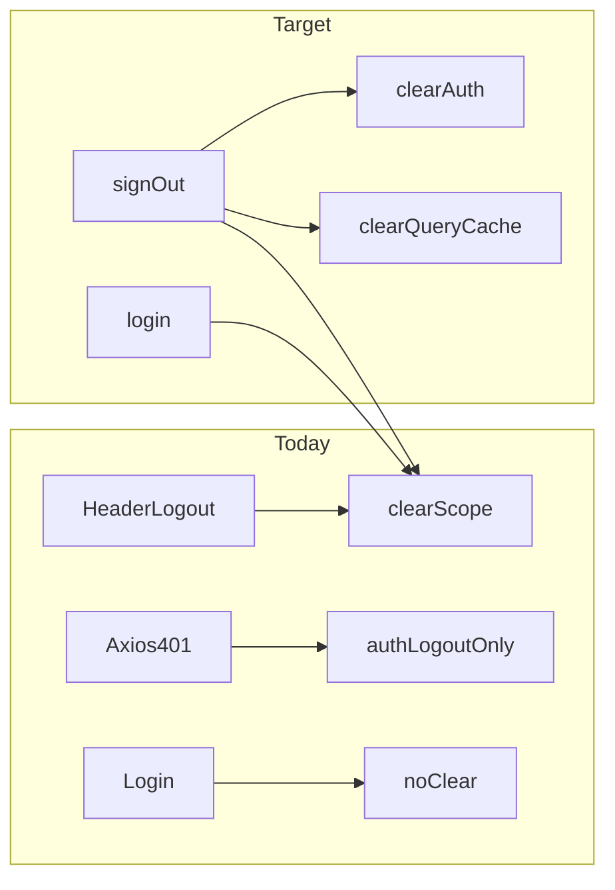

# Mandatory Scope Reset on Logout/Login

## Your concern is valid

The attached plan listed scope reset as **optional**. That should be **mandatory** for session hygiene and defense-in-depth.

## Current state (already implemented)

| Path                          | Clears `selectedMerchantId`?                                                                          |
| ----------------------------- | ----------------------------------------------------------------------------------------------------- |
| Header "Log out" button       | Yes — [`Header.tsx`](src/shared/components/layout/Header.tsx) calls `clearSelectedMerchantId()`       |
| `useScope()` for `shop_owner` | Ignores store — uses `user.merchantId` only ([`use-scope.ts`](src/shared/hooks/use-scope.ts) line 21) |
| Axios 401 logout              | **No** — only `authStore.logout()` ([`axios.ts`](src/shared/lib/axios.ts))                            |
| Successful login              | **No**                                                                                                |
| `authStore.logout()` itself   | **No** — scope clear is caller's responsibility                                                       |

**Shop-owner data leak via `useScope`:** unlikely today because `merchantId = isAdmin ? selectedMerchantId : userMerchantId` locks owners to their shop as soon as `login(user)` runs.

**Remaining risks:**

1. Next **admin** login inherits previous admin's shop filter without noticing
2. **401 logout** leaves stale scope + query cache
3. [`merchant-context.tsx`](src/shared/lib/merchant-context.tsx) reads `selectedMerchantId` **without role check** — latent bug if anything uses `useMerchantContext()` later



---

## Implementation (small, focused diff)

### 1. Centralize session teardown — `src/shared/lib/sign-out.ts`

Create a single exported function:

```ts
export function signOut(options?: { redirect?: boolean }): void {
  useAuthStore.getState().logout();
  useScopeStore.getState().clearSelectedMerchantId();
  queryClient.clear();
  if (options?.redirect !== false) {
    window.location.href = ROUTES.login;
  }
}
```

- Use `window.location.href` for 401 (hard navigation, matches axios today)
- Use `signOut({ redirect: false })` + React Router `navigate` from Header (preserves SPA navigation)

### 2. Wire all logout paths

| File                                                    | Change                                                                               |
| ------------------------------------------------------- | ------------------------------------------------------------------------------------ |
| [`Header.tsx`](src/shared/components/layout/Header.tsx) | Replace inline logout with `signOut({ redirect: false })` + `navigate(ROUTES.login)` |
| [`axios.ts`](src/shared/lib/axios.ts)                   | Replace `authStore.logout()` with `signOut()`                                        |

### 3. Mandatory scope reset on login

In [`LoginPage.tsx`](src/features/auth/components/LoginPage.tsx) `handleLogin`, **before** `login(user)`:

```ts
useScopeStore.getState().clearSelectedMerchantId();
```

Ensures admin→shop_owner and admin→admin handoffs never carry stale selection, even if logout was skipped in dev.

### 4. Fix `merchant-context` bypass

Update [`merchant-context.tsx`](src/shared/lib/merchant-context.tsx) to derive scope via `useScope().merchantId` instead of raw `useScopeStore((s) => s.selectedMerchantId)`.

This aligns the context with the role-aware hook and removes the latent leak vector.

### 5. Verification

- Log in as admin, select `shp-002`, log out, log in as shop owner → bookings/dashboard scoped to `shp-001` only
- Log in as admin, select shop, log out, log in as admin again → switcher shows "All shops" (null scope)
- `pnpm exec tsc --noEmit && pnpm lint && pnpm build`

No plan file edits. No changes to CASL, routes, or fixtures.
