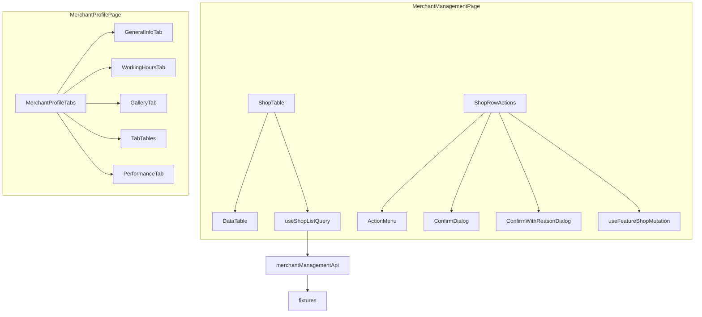

# Merchant Management Module Implementation Plan

> **For agentic workers:** REQUIRED SUB-SKILL: Use superpowers:subagent-driven-development (recommended) or superpowers:executing-plans to implement this plan task-by-task.

**Goal:** Deliver a fully typed Shop List (`/merchants`) and Shop Details view (`/merchants/:merchantId`) with 10 lazy-loaded tabs, server-side pagination/sorting/filtering, row actions with confirmation dialogs (reason required for Reject/Suspend), and optimistic Feature Shop toggling.

**Architecture:** Mirror [`src/features/user-management/`](src/features/user-management/) end-to-end — the only fully implemented list+profile module. Reuse existing shared infrastructure from Phase 0 of user-management ([`ActionMenu`](src/shared/components/action-menu/ActionMenu.tsx), [`ConfirmDialog`](src/shared/components/confirm-dialog/ConfirmDialog.tsx), [`DataTable`](src/shared/components/data-table/DataTable.tsx) + sorting, [`QuerySection`](src/shared/components/query/QuerySection.tsx), [`SortableHeader`](src/shared/components/data-table/SortableHeader.tsx)). Extend shared layer only where merchant-specific gaps exist (reason dialog, star rating, gallery upload). Fixture-backed API until backend is live (same as [`user-management-api.ts`](src/features/user-management/api/user-management-api.ts)). Profile tabs use **internal `useState`** (not URL-synced) — matching [`CustomerProfileTabs.tsx`](src/features/user-management/components/CustomerProfileTabs.tsx).

**Tech Stack:** React 19, TanStack Query v5, TanStack Table v8, RHF + Zod 4, shadcn/ui, CASL, `useResponsive` + [`src/theme/responsive.ts`](src/theme/responsive.ts), Recharts via [`ChartContainer`](src/shared/components/charts/ChartContainer.tsx).

---

## Current State

| Area                                                                       | Status                                             |
| -------------------------------------------------------------------------- | -------------------------------------------------- |
| [`src/features/merchant-management/`](src/features/merchant-management/)   | 5-file scaffold — empty page, stub API/hooks/types |
| Route `/merchants`                                                         | Wired; **no `RequirePermission` guard**            |
| Detail route                                                               | **Missing**                                        |
| Related modules (services, staff, packages, bookings, reviews, audit-logs) | All stubs — tab data lives in merchant fixtures    |
| `ConfirmDialog`                                                            | No reason/note input                               |
| Time picker / schedule editor                                              | **None** — build with native `Input type="time"`   |
| Star rating / gallery upload                                               | **None** — build shared primitives                 |
| `react-dropzone`                                                           | Installed, unused — wire in gallery tab            |



---

## Phase 0 — Shared Extensions (prerequisites)

Only build what user-management did not already provide.

### 0a. Add shadcn `textarea`

```bash
pnpm dlx shadcn@latest add textarea --yes
```

Creates [`src/shared/components/ui/textarea.tsx`](src/shared/components/ui/textarea.tsx).

### 0b. `ConfirmWithReasonDialog`

**Create:** [`src/shared/components/confirm-dialog/ConfirmWithReasonDialog.tsx`](src/shared/components/confirm-dialog/ConfirmWithReasonDialog.tsx)

Extends the AlertDialog pattern from [`ConfirmDialog.tsx`](src/shared/components/confirm-dialog/ConfirmDialog.tsx) with optional reason capture:

```tsx
export type ConfirmWithReasonDialogProps = {
  // ...same as ConfirmDialog
  reasonLabel?: string;
  reasonPlaceholder?: string;
  reasonRequired?: boolean;
  reasonMinLength?: number;
  onConfirm: (reason?: string) => void;
};
```

- Renders `Textarea` between description and footer when `reasonRequired` or `reasonLabel` set
- Disables confirm when `reasonRequired && reason.trim().length < reasonMinLength` (default min 3)
- Keep existing `ConfirmDialog` unchanged (user-management unaffected)

### 0c. `StarRating` (read-only)

**Create:** [`src/shared/components/rating/StarRating.tsx`](src/shared/components/rating/StarRating.tsx)

- Props: `value: number` (0–5), `size?: 'sm' | 'md'`, optional `showValue?: boolean`
- Lucide `Star` filled/empty based on rounded half or full stars
- Used in list columns, mobile cards, reviews tab, performance overview

### 0d. `ImageGalleryGrid` + `ImageUploadDropzone`

**Create:**

- [`src/shared/components/media/ImageGalleryGrid.tsx`](src/shared/components/media/ImageGalleryGrid.tsx) — responsive grid, delete button per image, skeleton/empty states
- [`src/shared/components/media/ImageUploadDropzone.tsx`](src/shared/components/media/ImageUploadDropzone.tsx) — `react-dropzone` wrapper, accepts images only, calls `onUpload(files: File[])`; fixture mode creates object URLs

No full Media Library integration yet — gallery tab uses these shared components with merchant-scoped fixture store.

---

## Phase 1 — Types

**Replace** [`src/features/merchant-management/types/index.ts`](src/features/merchant-management/types/index.ts).

### [`types/shop.ts`](src/features/merchant-management/types/shop.ts)

```ts
export type ShopStatus = 'pending' | 'approved' | 'rejected' | 'suspended';

export type ShopListItem = {
  id: string;
  shopName: string;
  ownerName: string;
  rating: number; // 0–5
  status: ShopStatus;
  city: string;
  activeServices: number;
  activeStaff: number;
  isFeatured: boolean;
  logoUrl?: string;
};

export type ShopListParams = ApiListParams & {
  status?: ShopStatus;
  city?: string;
  sortBy?: keyof Pick<
    ShopListItem,
    'shopName' | 'ownerName' | 'rating' | 'status' | 'city' | 'activeServices' | 'activeStaff'
  >;
};

export type ShopListResponse = PaginatedResponse<ShopListItem>;
```

Action payloads:

```ts
export type RejectShopInput = { reason: string };
export type SuspendShopInput = { reason: string };
export type UpdateShopGeneralInput = {
  /* name, owner, phone, email, address, city, description */
};
```

Zod schemas: `UpdateShopGeneralSchema`, `RejectShopSchema`, `SuspendShopSchema`, `WorkingHoursSchema`.

### [`types/shop-profile.ts`](src/features/merchant-management/types/shop-profile.ts)

`ShopProfile extends ShopListItem` + contact fields, address, description, `rejectionReason?`, `suspensionReason?`.

### [`types/working-hours.ts`](src/features/merchant-management/types/working-hours.ts)

```ts
export type DayOfWeek = 'mon' | 'tue' | 'wed' | 'thu' | 'fri' | 'sat' | 'sun';
export type DaySchedule = {
  isClosed: boolean;
  openTime: string | null;
  closeTime: string | null;
}; // HH:mm
export type WorkingHours = Record<DayOfWeek, DaySchedule>;
```

### [`types/shop-tabs.ts`](src/features/merchant-management/types/shop-tabs.ts)

Tab union + entity types for services, packages, staff, bookings, reviews, audit logs, performance chart series, gallery images:

```ts
export type ShopProfileTab =
  | 'general-information'
  | 'working-hours'
  | 'gallery'
  | 'services'
  | 'packages'
  | 'staff'
  | 'bookings'
  | 'reviews'
  | 'performance'
  | 'audit-history';

export const SHOP_PROFILE_TABS: ShopProfileTab[] = [/* 10 tabs */];
// ShopService, ShopPackage, ShopStaffMember, ShopBooking, ShopReview,
// ShopAuditLog, ShopGalleryImage, ShopPerformanceMetrics
```

---

## Phase 2 — Fixtures

**Create** under [`src/features/merchant-management/api/fixtures/`](src/features/merchant-management/api/fixtures/):

| File                            | Contents                                                                                                                                                                         |
| ------------------------------- | -------------------------------------------------------------------------------------------------------------------------------------------------------------------------------- |
| `shops.fixture.ts`              | 25–30 `ShopListItem` records — Kochi/Kerala salon names (reuse names from dashboard activity: Luxe Salon Kochi, Glow Studio Edappally, etc.), varied status/city/rating/featured |
| `shop-profile.fixture.ts`       | Extended profiles keyed by id                                                                                                                                                    |
| `shop-working-hours.fixture.ts` | Default weekly schedule per shop                                                                                                                                                 |
| `shop-gallery.fixture.ts`       | Placeholder image URLs per shop                                                                                                                                                  |
| `shop-tab-data.fixture.ts`      | Services, packages, staff, bookings, reviews, audit logs per shop                                                                                                                |
| `shop-performance.fixture.ts`   | 30-day bookings trend, revenue trend, rating trend arrays                                                                                                                        |

Export `SHOP_CITIES` constant (distinct cities for city filter Select).

---

## Phase 3 — API Layer

**Replace** [`src/features/merchant-management/api/merchant-management-api.ts`](src/features/merchant-management/api/merchant-management-api.ts).

Follow [`user-management-api.ts`](src/features/user-management/api/user-management-api.ts): mutable in-memory `shopsStore`, `paginate()`, `filterShops()`, `findShop()`, `syncProfileStore()`.

**Read functions:**

| Function                                                                | Returns                                                         |
| ----------------------------------------------------------------------- | --------------------------------------------------------------- |
| `getShops(params)`                                                      | Search shopName/ownerName, filter status + city, sort, paginate |
| `getShopById(id)`                                                       | `ShopProfile`                                                   |
| `getShopWorkingHours(id)`                                               | `WorkingHours`                                                  |
| `getShopGallery(id)`                                                    | `ShopGalleryImage[]`                                            |
| `getShopServices/Packages/Staff/Bookings/Reviews/AuditLogs(id, params)` | `PaginatedResponse<T>`                                          |
| `getShopPerformance(id, period?)`                                       | Chart series for 3 metrics                                      |

**Write functions:**

| Function                              | Notes                               |
| ------------------------------------- | ----------------------------------- |
| `updateShopGeneral(id, data)`         | PATCH general fields                |
| `updateShopWorkingHours(id, data)`    | Save schedule                       |
| `uploadShopGalleryImages(id, files)`  | Append object URLs to fixture store |
| `deleteShopGalleryImage(id, imageId)` | Remove from store                   |
| `approveShop(id)`                     | status → approved                   |
| `rejectShop(id, { reason })`          | status → rejected, store reason     |
| `suspendShop(id, { reason })`         | status → suspended, store reason    |
| `toggleFeatureShop(id, featured)`     | Set `isFeatured`                    |

JSDoc block listing future REST endpoints. No `apiClient` calls yet.

---

## Phase 4 — TanStack Query Hooks

**Replace** [`src/features/merchant-management/hooks/use-merchant-management-queries.ts`](src/features/merchant-management/hooks/use-merchant-management-queries.ts).

**Query keys:**

```ts
['merchant-management', 'list', params][('merchant-management', 'detail', merchantId)][
  ('merchant-management', 'detail', merchantId, 'working-hours')
][('merchant-management', 'detail', merchantId, 'gallery')][
  ('merchant-management', 'detail', merchantId, 'services', params)
][
  // ... packages, staff, bookings, reviews, audit-history
  ('merchant-management', 'detail', merchantId, 'performance', period)
];
```

All list/tab queries: `placeholderData: keepPreviousData`.

**Mutations + invalidation** (mirror user-management `useInvalidateCustomer`):

- `useUpdateShopGeneralMutation`, `useUpdateWorkingHoursMutation`
- `useApproveShopMutation`, `useRejectShopMutation`, `useSuspendShopMutation`
- `useUploadGalleryMutation`, `useDeleteGalleryImageMutation`

**Optimistic Feature Shop** — `useFeatureShopMutation`:

```ts
onMutate: async ({ merchantId, featured }) => {
  await queryClient.cancelQueries({ queryKey: ['merchant-management', 'list'] });
  const previous = queryClient.getQueryData(...);
  queryClient.setQueryData(['merchant-management', 'list', params], (old) => /* patch isFeatured */);
  return { previous };
},
onError: (_err, _vars, context) => { /* rollback */ },
onSettled: () => { invalidate list + detail },
```

Direct toggle from row action (no confirm) — menu label toggles "Feature Shop" / "Unfeature Shop" based on `shop.isFeatured`.

---

## Phase 5 — Shop List UI

Mirror [`CustomerTable.tsx`](src/features/user-management/components/CustomerTable.tsx) and related files.

### Components to create

| Component                                                                                              | Responsibility                                                                                                     |
| ------------------------------------------------------------------------------------------------------ | ------------------------------------------------------------------------------------------------------------------ |
| [`MerchantManagementPage.tsx`](src/features/merchant-management/components/MerchantManagementPage.tsx) | `layout.pageStack` header + `<ShopTable />`                                                                        |
| [`ShopTable.tsx`](src/features/merchant-management/components/ShopTable.tsx)                           | pagination, debounced search, status + city filters, sorting → query → `QuerySection` → `DataTable`                |
| [`merchant-columns.tsx`](src/features/merchant-management/components/merchant-columns.tsx)             | `useShopColumns()` — name, owner, `<StarRating>`, status badge, city, services, staff, featured indicator, actions |
| [`ShopStatusBadge.tsx`](src/features/merchant-management/components/ShopStatusBadge.tsx)               | Maps 4 statuses → `Badge` variants                                                                                 |
| [`ShopStatusFilter.tsx`](src/features/merchant-management/components/ShopStatusFilter.tsx)             | Status Select (all/pending/approved/rejected/suspended)                                                            |
| [`ShopCityFilter.tsx`](src/features/merchant-management/components/ShopCityFilter.tsx)                 | City Select from `SHOP_CITIES`                                                                                     |
| [`ShopMobileCard.tsx`](src/features/merchant-management/components/ShopMobileCard.tsx)                 | Stacked card + row actions slot                                                                                    |
| [`ShopRowActions.tsx`](src/features/merchant-management/components/ShopRowActions.tsx)                 | ActionMenu + dialogs + mutations                                                                                   |

### Row actions

| Action              | Behavior                                          | Dialog                                      | Permission         |
| ------------------- | ------------------------------------------------- | ------------------------------------------- | ------------------ |
| View                | `navigate(shopDetailPath(id))`                    | —                                           | `merchants:view`   |
| Edit                | Navigate to detail General tab or open edit sheet | —                                           | `merchants:manage` |
| Approve             | Mutation                                          | `ConfirmDialog` (simple)                    | `merchants:manage` |
| Reject              | Mutation                                          | `ConfirmWithReasonDialog` (required reason) | `merchants:manage` |
| Suspend             | Mutation                                          | `ConfirmWithReasonDialog` (required reason) | `merchants:manage` |
| Feature / Unfeature | Optimistic toggle                                 | —                                           | `merchants:manage` |

Visibility rules: Approve/Reject hidden unless `status === 'pending'`; Suspend hidden unless `status === 'approved'`; Feature only when approved.

Default page size: **20**. Sortable: shopName, ownerName, rating, status, city, activeServices, activeStaff.

Mobile cards via `DataTable.renderMobileCard` (same breakpoint as user-management: `md` via `useResponsive` inside DataTable).

---

## Phase 6 — Shop Details UI (10 tabs)

### Routing

**Modify** [`src/shared/config/routes.ts`](src/shared/config/routes.ts):

```ts
merchantDetail: '/merchants/:merchantId',
export function shopDetailPath(merchantId: string): string {
  return `/merchants/${merchantId}`;
}
```

**Modify** [`src/app/router.tsx`](src/app/router.tsx) + [`lazy-pages.tsx`](src/app/lazy-pages.tsx):

- Guard list + detail with `RequirePermission action="view" subject={PERMISSIONS.merchants.view}`
- Lazy-load `MerchantProfilePage`

**Modify** [`index.ts`](src/features/merchant-management/index.ts) — export `MerchantProfilePage`.

### Shell components

| Component                                                                                            | Pattern source                                                                  |
| ---------------------------------------------------------------------------------------------------- | ------------------------------------------------------------------------------- |
| [`MerchantProfilePage.tsx`](src/features/merchant-management/components/MerchantProfilePage.tsx)     | `CustomerProfilePage` — `useParams`, header + tabs                              |
| [`MerchantProfileHeader.tsx`](src/features/merchant-management/components/MerchantProfileHeader.tsx) | Back link, breadcrumb, shop name, owner, status, `<StarRating>`, featured badge |
| [`MerchantProfileTabs.tsx`](src/features/merchant-management/components/MerchantProfileTabs.tsx)     | Tabs at `lg+`, Accordion below; lazy-mount active tab only                      |

### Tab components

| Tab                 | Component                                                                                        | Data / UI                                                                                                                                                                                                                                                   |
| ------------------- | ------------------------------------------------------------------------------------------------ | ----------------------------------------------------------------------------------------------------------------------------------------------------------------------------------------------------------------------------------------------------------- |
| General Information | [`ShopGeneralInfoTab.tsx`](src/features/merchant-management/components/ShopGeneralInfoTab.tsx)   | RHF + Zod form, `useShopProfileQuery` + `useUpdateShopGeneralMutation`, `QuerySection` skeleton                                                                                                                                                             |
| Working Hours       | [`ShopWorkingHoursTab.tsx`](src/features/merchant-management/components/ShopWorkingHoursTab.tsx) | [`ShopWorkingHoursEditor.tsx`](src/features/merchant-management/components/ShopWorkingHoursEditor.tsx) — 7 rows: day label, closed Switch (add shadcn `switch` if missing), `Input type="time"` open/close disabled when closed                             |
| Gallery             | [`ShopGalleryTab.tsx`](src/features/merchant-management/components/ShopGalleryTab.tsx)           | `ImageUploadDropzone` + `ImageGalleryGrid`, upload/delete mutations                                                                                                                                                                                         |
| Services            | [`ShopServicesTab.tsx`](src/features/merchant-management/components/ShopServicesTab.tsx)         | `MerchantTabTable` pattern + `merchant-service-columns.tsx`; optional `Link to={ROUTES.services}` in header                                                                                                                                                 |
| Packages            | [`ShopPackagesTab.tsx`](src/features/merchant-management/components/ShopPackagesTab.tsx)         | Same + link to `ROUTES.packages`                                                                                                                                                                                                                            |
| Staff               | [`ShopStaffTab.tsx`](src/features/merchant-management/components/ShopStaffTab.tsx)               | Same + link to `ROUTES.staff`                                                                                                                                                                                                                               |
| Bookings            | [`ShopBookingsTab.tsx`](src/features/merchant-management/components/ShopBookingsTab.tsx)         | Reuse column patterns from [`customer-booking-columns.tsx`](src/features/user-management/components/customer-booking-columns.tsx)                                                                                                                           |
| Reviews             | [`ShopReviewsTab.tsx`](src/features/merchant-management/components/ShopReviewsTab.tsx)           | Columns with `<StarRating>` + comment                                                                                                                                                                                                                       |
| Performance         | [`ShopPerformanceTab.tsx`](src/features/merchant-management/components/ShopPerformanceTab.tsx)   | `ResponsiveGrid preset="twoColumnCharts"` + 3 chart components using `ChartContainer` + `useChartResponsive` (bookings trend line, revenue area, rating line) — mirror [`DailyBookingsChart.tsx`](src/features/dashboard/components/DailyBookingsChart.tsx) |
| Audit History       | [`ShopAuditHistoryTab.tsx`](src/features/merchant-management/components/ShopAuditHistoryTab.tsx) | Paginated table like [`CustomerAuditLogsTab.tsx`](src/features/user-management/components/CustomerAuditLogsTab.tsx)                                                                                                                                         |

**Reuse** [`CustomerTabTable.tsx`](src/features/user-management/components/CustomerTabTable.tsx) pattern — copy/adapt as [`MerchantTabTable.tsx`](src/features/merchant-management/components/MerchantTabTable.tsx) + `useMerchantTabQueryParams()`.

If shadcn `switch` missing: `pnpm dlx shadcn@latest add switch --yes`.

---

## Phase 7 — i18n

Populate both locale files with nested keys:

- [`src/locales/en/merchant-management.json`](src/locales/en/merchant-management.json)
- [`src/locales/ml/merchant-management.json`](src/locales/ml/merchant-management.json)

Key groups: `page`, `list`, `columns`, `status`, `actions`, `confirm`, `confirmReason`, `tabs`, `general`, `workingHours`, `gallery`, `performance`, `empty`, `errors`, `pagination` (mirror user-management structure).

---

## Phase 8 — Verification

```bash
pnpm exec tsc --noEmit
pnpm lint
pnpm build
```

Manual checks at sm/md/lg:

- `/merchants` — search, status + city filters, sort, pagination, mobile cards, all row actions
- Reject/Suspend — reason required, stored in fixture profile
- Feature Shop — immediate UI toggle with rollback on error
- `/merchants/:id` — all 10 tabs load independently with skeleton/error/empty
- Performance charts render responsively
- CASL: manage actions hidden without `merchants:manage`

---

## Files Summary

### Shared — create (4–5)

- `src/shared/components/ui/textarea.tsx` (shadcn)
- `src/shared/components/ui/switch.tsx` (shadcn, if missing)
- `src/shared/components/confirm-dialog/ConfirmWithReasonDialog.tsx`
- `src/shared/components/rating/StarRating.tsx`
- `src/shared/components/media/ImageGalleryGrid.tsx`
- `src/shared/components/media/ImageUploadDropzone.tsx`

### App — modify (3)

- [`src/shared/config/routes.ts`](src/shared/config/routes.ts)
- [`src/app/router.tsx`](src/app/router.tsx)
- [`src/app/lazy-pages.tsx`](src/app/lazy-pages.tsx)

### Feature — create (~50)

- `types/` — `shop.ts`, `shop-profile.ts`, `working-hours.ts`, `shop-tabs.ts`
- `api/fixtures/` — 6 fixture files
- `api/merchant-management-api.ts` (replace)
- `hooks/use-merchant-management-queries.ts` (replace)
- List: `ShopTable`, `merchant-columns`, `ShopRowActions`, `ShopStatusBadge`, `ShopStatusFilter`, `ShopCityFilter`, `ShopMobileCard`
- Detail shell: `MerchantProfilePage`, `MerchantProfileHeader`, `MerchantProfileTabs`
- Tabs (10): `ShopGeneralInfoTab`, `ShopWorkingHoursTab`, `ShopWorkingHoursEditor`, `ShopGalleryTab`, `ShopServicesTab`, `ShopPackagesTab`, `ShopStaffTab`, `ShopBookingsTab`, `ShopReviewsTab`, `ShopPerformanceTab`, `ShopAuditHistoryTab`
- Charts (3): `ShopBookingsTrendChart`, `ShopRevenueTrendChart`, `ShopRatingTrendChart`
- Columns (6): `merchant-service-columns`, `merchant-package-columns`, `merchant-staff-columns`, `merchant-booking-columns`, `merchant-review-columns`, `merchant-audit-columns`
- Shared tab helper: `MerchantTabTable.tsx`

### Feature — modify (3)

- [`MerchantManagementPage.tsx`](src/features/merchant-management/components/MerchantManagementPage.tsx)
- [`types/index.ts`](src/features/merchant-management/types/index.ts)
- [`index.ts`](src/features/merchant-management/index.ts)

**Total: ~60 files touched**

---

## Out of Scope (explicit)

- Real backend API / `apiClient` integration
- URL-synced profile tabs
- Full Media Library module page
- Cross-module deep links with working destination pages (links to stub routes only)
- FullCalendar-based schedule editor (native time inputs used instead)
- Toast notifications (inline mutation feedback like user-management)
