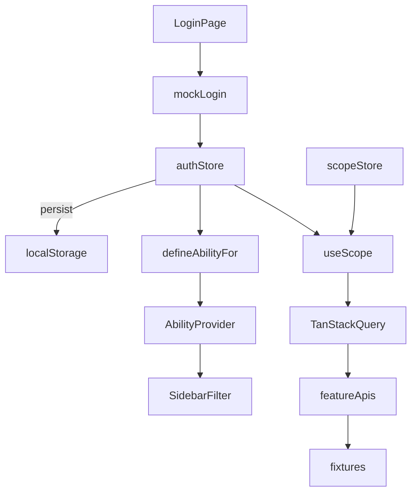

# Mock Auth and Role-Based Dashboard Flow

## Path mapping (prompt → project conventions)

The prompt uses generic paths; this plan follows existing StyleUp ERP layout:

| Prompt path                            | Project path                                                                                                                                                                                                                                                                                                                                |
| -------------------------------------- | ------------------------------------------------------------------------------------------------------------------------------------------------------------------------------------------------------------------------------------------------------------------------------------------------------------------------------------------- |
| `src/store/authStore.ts`               | [`src/shared/lib/auth-store.ts`](src/shared/lib/auth-store.ts)                                                                                                                                                                                                                                                                              |
| `src/mocks/users.ts`, `shops.ts`, etc. | Feature fixtures under `src/features/*/api/fixtures/` + [`src/features/auth/api/fixtures/`](src/features/auth/api/fixtures/)                                                                                                                                                                                                                |
| `src/config/menuConfig.ts`             | **No separate role menu file** — extend [`src/shared/lib/casl-ability.ts`](src/shared/lib/casl-ability.ts) + filter existing [`src/shared/config/navigation.ts`](src/shared/config/navigation.ts) by CASL (per [`.cursor/rules/100-auth-permissions.mdc`](.cursor/rules/100-auth-permissions.mdc): no `user.role === '...'` in sidebar JSX) |
| `src/hooks/useScope.ts`                | [`src/shared/hooks/use-scope.ts`](src/shared/hooks/use-scope.ts)                                                                                                                                                                                                                                                                            |
| `src/components/ShopSwitcher.tsx`      | [`src/shared/components/layout/ShopSwitcher.tsx`](src/shared/components/layout/ShopSwitcher.tsx)                                                                                                                                                                                                                                            |
| `src/components/ProtectedRoute.tsx`    | [`src/app/guards/ProtectedRoute.tsx`](src/app/guards/ProtectedRoute.tsx)                                                                                                                                                                                                                                                                    |
| `src/services/*.ts`                    | Extend existing feature APIs: [`booking-management-api.ts`](src/features/booking-management/api/booking-management-api.ts), [`staff-management-api.ts`](src/features/staff-management/api/staff-management-api.ts), [`dashboard-api.ts`](src/features/dashboard/api/dashboard-api.ts)                                                       |

**Terminology:** `shopId` in the prompt = `merchantId` in code (matches [`ROUTES.merchants`](src/shared/config/routes.ts) and [`shops.fixture.ts`](src/features/merchant-management/api/fixtures/shops.fixture.ts) IDs like `shp-001`).



---

## Phase 1 — Auth types, store, fixtures, API

### 1a. Shared auth types

Create [`src/shared/types/auth.ts`](src/shared/types/auth.ts):

```ts
export type UserRole = 'super_admin' | 'shop_owner'; // extend later: staff, finance_admin, …

export type AuthUser = {
  id: string;
  name: string;
  email: string;
  role: UserRole;
  merchantId: string | null; // null for super_admin
  token: string;
};
```

### 1b. Auth store (Zustand + persist)

Create [`src/shared/lib/auth-store.ts`](src/shared/lib/auth-store.ts) — first store in the project to use `persist` middleware:

- **State:** `user: AuthUser | null`, `isAuthenticated: boolean`
- **Actions:** `login(user)`, `logout()`, `setUser(user)`
- **Persist:** `localStorage` key `styleup-auth` (user + token only; no secrets beyond mock token)
- **Hydration:** export `_hasHydrated` / `onFinishHydration` so guards wait before redirecting (avoids flash to `/login` on refresh)

Follow selector pattern from [`merchant-store.ts`](src/shared/lib/merchant-store.ts).

### 1c. Auth feature (login mock)

Create [`src/features/auth/`](src/features/auth/) per folder-structure rule:

| File                             | Purpose                                                                                 |
| -------------------------------- | --------------------------------------------------------------------------------------- |
| `api/fixtures/users.fixture.ts`  | 2 mock users: super_admin (`merchantId: null`), shop_owner (`merchantId: 'shp-001'`)    |
| `api/auth-api.ts`                | `mockLogin(email, password)` — find user, ~400ms delay, throw on mismatch               |
| `components/LoginPage.tsx`       | RHF + Zod email/password form; success → `authStore.login()` → `navigate('/dashboard')` |
| `components/DevLoginButtons.tsx` | `import.meta.env.DEV` only — "Login as Admin" / "Login as Shop Owner"                   |
| `index.ts`                       | Export `LoginPage`                                                                      |

Add [`ROUTES.login`](src/shared/config/routes.ts) = `/login`.

---

## Phase 2 — Route guards and provider wiring

### 2a. `ProtectedRoute` (authentication only)

Create [`src/app/guards/ProtectedRoute.tsx`](src/app/guards/ProtectedRoute.tsx):

- Not authenticated → `<Navigate to={ROUTES.login} replace />`
- Wait for auth persist hydration → render `<PageLoader />`
- Does **not** check roles (CASL handles authorization)

### 2b. Router restructure

Update [`src/app/router.tsx`](src/app/router.tsx):

```tsx
{ path: ROUTES.login, element: <LoginPage /> }
{
  path: ROUTES.home,
  element: (
    <ProtectedRoute>
      <AppShell />
    </ProtectedRoute>
  ),
  children: [ /* existing routes */ ],
}
```

- Redirect authenticated users away from `/login` to `/dashboard`
- Wrap **admin-only** routes with existing [`RequirePermission`](src/app/guards/RequirePermission.tsx):
  - Already guarded: users, merchants
  - **Add guards:** `roles`, `auditLogs`, `reports`, `settings`, `users`, `merchants`, `promotions`, `messaging`, `notifications`, `loyalty`, `media`, `packages`, `calendar` (platform modules shop_owner should not access)

Shop-owner-accessible routes stay unguarded or guarded with permissions they have: `dashboard`, `staff`, `bookings`, `services`, `reviews`, `payments`.

Register lazy import in [`src/app/lazy-pages.tsx`](src/app/lazy-pages.tsx).

### 2c. Dynamic CASL ability

Update [`src/shared/lib/casl-ability.ts`](src/shared/lib/casl-ability.ts):

- `defineAbilityFor(role?: UserRole)` maps roles → permission sets:
  - **`super_admin`:** all keys from [`PERMISSIONS`](src/shared/config/permissions.ts) (current dev behavior)
  - **`shop_owner`:** subset matching prompt menu — `dashboard`, `staff`, `bookings`, `services`, `reviews`, `payments` (view + manage where appropriate for own-shop ops)

Create [`src/app/providers/AbilityBridge.tsx`](src/app/providers/AbilityBridge.tsx):

```tsx
const role = useAuthStore((s) => s.user?.role);
const ability = useMemo(() => defineAbilityFor(role), [role]);
return <AbilityProvider value={ability}>{children}</AbilityProvider>;
```

Replace static `defaultAbility` in [`src/app/providers.tsx`](src/app/providers.tsx). Clear query cache on logout.

### 2d. Axios ready for backend swap

Update [`src/shared/lib/axios.ts`](src/shared/lib/axios.ts):

- Request interceptor: attach `Authorization: Bearer ${token}` from auth store
- Response interceptor: `401` → `authStore.logout()` + `window.location.href = ROUTES.login`
- No real HTTP calls from mock APIs yet; structure is in place for one-file swap later

---

## Phase 3 — Scope hook and shop switcher

### 3a. Consolidate scope store

Repurpose [`src/shared/lib/merchant-store.ts`](src/shared/lib/merchant-store.ts) → **`scope-store.ts`** (or extend in place):

- `selectedMerchantId: string | null` — admin's global shop filter (`null` = ALL shops)
- `setSelectedMerchantId(id | null)`, `clearSelectedMerchantId()`
- Persist selection separately (optional) or reset on logout

Update [`merchant-context.tsx`](src/shared/lib/merchant-context.tsx) to re-export scope or deprecate in favor of `useScope`.

### 3b. `useScope` hook

Create [`src/shared/hooks/use-scope.ts`](src/shared/hooks/use-scope.ts):

| Field                   | Logic                                                                                                |
| ----------------------- | ---------------------------------------------------------------------------------------------------- |
| `isAdmin`               | `user.role === 'super_admin'` (only place role is read for scope derivation — not for permission UI) |
| `merchantId`            | Admin: `selectedMerchantId`; Owner: locked `user.merchantId`                                         |
| `selectedMerchantId`    | From scope store (admin only)                                                                        |
| `setSelectedMerchantId` | No-op for shop_owner                                                                                 |

Alias export `shopId = merchantId` if helpful for readability in new code.

### 3c. Shop switcher in header

Create [`src/shared/components/layout/ShopSwitcher.tsx`](src/shared/components/layout/ShopSwitcher.tsx):

- Renders only when `useScope().isAdmin`
- Dropdown: "All shops" + 3–4 entries from [`shopsFixture`](src/features/merchant-management/api/fixtures/shops.fixture.ts) (`shp-001`, `shp-002`, `shp-003`, …)
- On select → `setSelectedMerchantId`; invalidate TanStack queries via `queryClient.invalidateQueries()` or rely on queryKey change

Wire into [`Header.tsx`](src/shared/components/layout/Header.tsx): `ShopSwitcher` + user name + Logout button.

---

## Phase 4 — Role-filtered sidebar (no hardcoded role JSX)

Update [`Sidebar.tsx`](src/shared/components/layout/Sidebar.tsx) / `SidebarContent`:

```tsx
const ability = usePermissions();
const visibleItems = group.items.filter(
  (item) => !item.permission || ability.can('view', item.permission)
);
// skip empty groups
```

Existing `NavItemConfig.permission` fields in [`navigation.ts`](src/shared/config/navigation.ts) already map to the prompt's admin vs owner menus once CASL rules differ by role. No new `menuConfig` object needed.

---

## Phase 5 — Mock service layer (feature APIs + fixtures)

Extend stub APIs with fixture-backed, scope-filtered functions (~300–500ms delay helper in [`src/shared/lib/mock-delay.ts`](src/shared/lib/mock-delay.ts)):

### 5a. Bookings

- [`src/features/booking-management/api/fixtures/bookings.fixture.ts`](src/features/booking-management/api/fixtures/bookings.fixture.ts) — 5–6 rows across `shp-001` / `shp-002` with fields: `customerName`, `serviceName`, `staffName`, `status`, `scheduledAt`, `paymentStatus`, `merchantId`
- [`booking-management-api.ts`](src/features/booking-management/api/booking-management-api.ts): `getBookings(merchantId?: string | null)` — filter when id set, return all when null
- Types in `types/booking.ts`, hook `useBookingsQuery(merchantId)` with `queryKey: ['booking-management', 'list', merchantId ?? 'all']`

### 5b. Staff

- [`staff.fixture.ts`](src/features/staff-management/api/fixtures/staff.fixture.ts) — 4–5 rows: `name`, `merchantId`, `shopName`, `role`, `rating`, `availability`, `status`
- [`staff-management-api.ts`](src/features/staff-management/api/staff-management-api.ts): `getStaff(merchantId?)`
- Hook with scoped queryKey

### 5c. Minimal demo UI on stub pages

Update [`BookingManagementPage.tsx`](src/features/booking-management/components/BookingManagementPage.tsx) and [`StaffManagementPage.tsx`](src/features/staff-management/components/StaffManagementPage.tsx):

- Read `useScope().merchantId`
- Show simple scoped list/table (or count + merchant label) proving filter works
- Full module UI is out of scope; enough to verify admin ALL vs selected shop vs owner lock

Reuse field shapes from [`shop-tab-data.fixture.ts`](src/features/merchant-management/api/fixtures/shop-tab-data.fixture.ts) where possible.

---

## Phase 6 — Scope-aware dashboard

### 6a. Scoped KPI + chart fixtures

- Add per-shop KPI slices in [`dashboard-kpis.fixture.ts`](src/features/dashboard/api/fixtures/dashboard-kpis.fixture.ts) (or compute from bookings fixture)
- Update [`dashboard-api.ts`](src/features/dashboard/api/dashboard-api.ts): `getDashboardKpis(merchantId?: string | null)` — aggregate all when null, shop slice when set

### 6b. Query hooks

Update [`use-dashboard-queries.ts`](src/features/dashboard/hooks/use-dashboard-queries.ts):

```ts
const { merchantId } = useScope();
useQuery({
  queryKey: ['dashboard', 'kpis', merchantId ?? 'all'],
  queryFn: () => getDashboardKpis(merchantId),
});
```

Same pattern for `getTopShopsChart` — show only when `merchantId === null` (admin ALL view).

### 6c. Dashboard page UX

Update [`DashboardPage.tsx`](src/features/dashboard/components/DashboardPage.tsx) / [`KpiCardGrid.tsx`](src/features/dashboard/components/KpiCardGrid.tsx):

- Admin + ALL: platform KPIs + `TopShopsChart`
- Admin + selected shop OR shop_owner: shop-scoped KPIs; hide platform-only cards (`totalShops`, `totalCustomers`) and `TopShopsChart`
- Optional subtitle showing active scope ("All shops" vs shop name)

---

## Phase 7 — i18n and locales

Add [`src/locales/en/auth.json`](src/locales/en/auth.json) + [`src/locales/ml/auth.json`](src/locales/ml/auth.json) (login labels, dev buttons, errors).

Register namespace in i18n config if not auto-loaded.

Add header strings to `common.json` (`nav.logout`, `scope.allShops`, `scope.selectShop`).

---

## Phase 8 — Verification

Manual smoke test matrix:

| Action                                              | Expected                                                                 |
| --------------------------------------------------- | ------------------------------------------------------------------------ |
| Dev "Login as Admin"                                | Full sidebar, ShopSwitcher visible, dashboard shows ALL KPIs + Top Shops |
| Select `shp-001` in switcher                        | KPIs/charts refetch for that shop; bookings/staff lists filter           |
| Logout → "Login as Shop Owner"                      | Limited sidebar (6 items), no ShopSwitcher, locked to `shp-001`          |
| Navigate to `/roles` or `/merchants` as owner       | `/permission-denied`                                                     |
| Refresh page while logged in                        | Stays authenticated (persist)                                            |
| `pnpm exec tsc --noEmit && pnpm lint && pnpm build` | Clean                                                                    |

---

## Files touched (summary)

**New:** `auth-store.ts`, `scope-store.ts` (or extended merchant-store), `use-scope.ts`, `mock-delay.ts`, `auth.ts` types, `features/auth/*`, `ProtectedRoute.tsx`, `AbilityBridge.tsx`, `ShopSwitcher.tsx`, booking/staff fixtures + types/hooks, auth locales

**Modified:** `router.tsx`, `providers.tsx`, `casl-ability.ts`, `axios.ts`, `routes.ts`, `lazy-pages.tsx`, `Header.tsx`, `Sidebar.tsx`, `dashboard-api.ts`, `use-dashboard-queries.ts`, `DashboardPage.tsx`, booking/staff pages, i18n config

**Not created:** `src/store/`, `src/mocks/`, `src/services/`, `menuConfig.ts` — intentionally avoided per project rules
