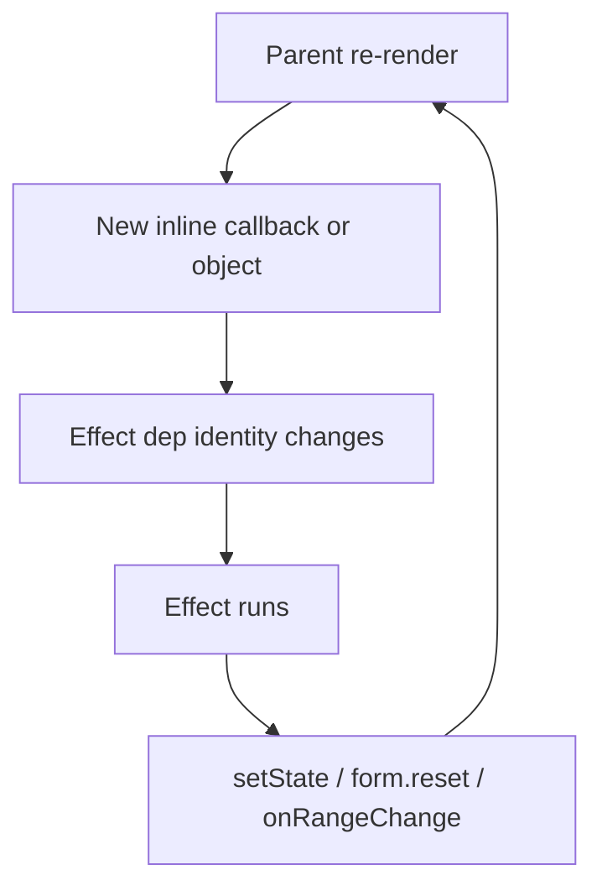

# React Effect Hygiene Rule, Skill, and Audit

## Context

Two production bugs were fixed in the prior session:

- **Infinite loop** — [`CalendarView.tsx`](src/features/calendar-scheduling/components/calendar/CalendarView.tsx): effect depended on `onRangeChange` while tabs passed inline callbacks
- **Input reset** — [`ManualBookingSheet.tsx`](src/features/calendar-scheduling/components/ManualBookingSheet.tsx): `form.reset()` effect with unstable `staffOptions` + inline `values:` objects in form sheets

This plan adds preventive documentation only — **no code fixes** in the audited features.

---

## Task 1 — Rule: [`.cursor/rules/095-react-effect-hygiene.mdc`](.cursor/rules/095-react-effect-hygiene.mdc)

### Frontmatter (match existing rules)

```yaml
---
description: When to stabilize useEffect/useMemo deps — precision over blanket memoization
globs: '**/*.tsx'
alwaysApply: false
---
```

Tone/format reference: [`000-project-context.mdc`](.cursor/rules/000-project-context.mdc) (terse bullets, tables sparingly) and [`090-calendar-scheduling.mdc`](.cursor/rules/090-calendar-scheduling.mdc) (concrete file links, no theory walls).

### Rule sections (actionable bullets)

1. **Stabilize only when both conditions hold**
   - Fresh every render (inline `() => {}`, `{...}`, `[...]`, or `.filter()`/`.map()` in render body)
   - AND consumed in a `useEffect`/`useMemo`/`useCallback` dep array, OR passed to a child that uses it in an effect dep
   - Explicit filter: JSX-only / direct event handlers → **do not memoize**

2. **Callback props + child effects** (CalendarView pattern)
   - Preferred: child stores callback in ref, excludes from effect deps (`onRangeChangeRef.current = onRangeChange`)
   - Alternative: parent `useCallback` only when child must react to callback identity change (rare)
   - Default ref approach for "notify parent on internal change" (range, scroll, dirty state)

3. **Setter/reset/mutation effects — dep audit**
   - Every dep must be primitive OR proven stable upstream
   - Narrow objects to primitive fields (`slot?.id, slot?.start, slot?.end`) over memoizing whole objects
   - Never put `form` from `useForm` in reset-effect deps unless unavoidable

4. **RHF `values:` option**
   - Inline `values: entity ? { ... } : undefined` re-syncs every render → mid-edit reset
   - Fix: memoize `editValues` keyed on entity primitive fields, OR `defaultValues` + guarded `reset()` on open only

5. **Read/write feedback loop red flag**
   - Effect sets state → parent re-renders → new unstable dep → effect runs again
   - Check during review, not only after crash

6. **When NOT to memoize** (short section)
   - JSX-only values, primitives, local-only objects never in deps, inline `onClick` handlers not used as deps

### Canonical before/after snippets (embed in rule)

**Bug 1 — CalendarView infinite loop**

Before (child effect + parent inline callback):

```tsx
// CalendarView.tsx — BAD
useEffect(() => {
  const range = getVisibleRange(internalDate, effectiveView);
  onRangeChange(range.start, range.end);
}, [internalDate, effectiveView, onRangeChange]);

// ShopCalendarTab.tsx — BAD
onRangeChange={(start, end) => setRange({ start, end })}
```

After (ref in child + stable parent callback):

```tsx
// CalendarView.tsx — GOOD
const onRangeChangeRef = useRef(onRangeChange);
const lastRangeRef = useRef<{ start: string; end: string } | null>(null);
onRangeChangeRef.current = onRangeChange;

useEffect(() => {
  const range = getVisibleRange(internalDate, effectiveView);
  if (lastRangeRef.current?.start === range.start && lastRangeRef.current?.end === range.end)
    return;
  lastRangeRef.current = range;
  onRangeChangeRef.current(range.start, range.end);
}, [internalDate, effectiveView]);

// Tab — GOOD
const handleRangeChange = useCallback((start: string, end: string) => {
  setRange((prev) => (prev.start === start && prev.end === end ? prev : { start, end }));
}, []);
```

**Bug 2 — ManualBookingSheet input reset**

Before:

```tsx
const staffOptions = staffFixture.filter((s) => s.merchantId === shopId); // new array every render

useEffect(() => {
  if (!open) return;
  form.reset({ /* ... */ staffId: staffOptions[0]?.id ?? '' });
}, [open, shopId, defaultStart, defaultStaffId, staffOptions, form]);

// Form sheets — BAD
values: slot ? { scope: slot.scope, start: slot.start, /* ... */ } : undefined,
```

After:

```tsx
const staffOptions = useMemo(() => staffFixture.filter((s) => s.merchantId === shopId), [shopId]);

useEffect(() => {
  if (!open) return;
  form.reset({ /* ... */ staffId: defaultStaffIdResolved });
}, [open, shopId, defaultStart, defaultStaffId, defaultStaffIdResolved]);

const editValues = useMemo(
  () => slot ? { scope: slot.scope, start: toDatetimeLocal(slot.start), /* ... */ } : undefined,
  [slot?.id, slot?.scope, slot?.start, slot?.end, /* primitive fields only */],
);
values: editValues,
```

Cross-reference: complements [`030-react-components.mdc`](.cursor/rules/030-react-components.mdc) and [`060-forms-validation.mdc`](.cursor/rules/060-forms-validation.mdc) without duplicating RHF wiring basics.

---

## Task 2 — Skill: [`.cursor/skills/react-render-loop-debugging/SKILL.md`](.cursor/skills/react-render-loop-debugging/SKILL.md)

Project convention: 10 existing skills under [`.cursor/skills/`](.cursor/skills/) as `skill-name/SKILL.md` with YAML frontmatter (`name`, `description`) — match [`react/SKILL.md`](.cursor/skills/react/SKILL.md) and [`react-hook-form-zod/SKILL.md`](.cursor/skills/react-hook-form-zod/SKILL.md).

```yaml
---
name: react-render-loop-debugging
description: Diagnose Maximum update depth and form field reset bugs from unstable effect dependencies
---
```

### Skill body outline

1. **Symptom: "Maximum update depth exceeded"**
   - Suspect first: effect that reads prop/state AND calls setter/callback that changes upstream state
   - Trace: child effect dep includes callback prop → parent passes inline arrow → loop
   - Fix patterns → link [`.cursor/rules/095-react-effect-hygiene.mdc`](.cursor/rules/095-react-effect-hygiene.mdc) §2 and §5

2. **Symptom: "Input resets while typing"**
   - Search `useEffect` + `form.reset` / `setState` with object/array/function in deps
   - Search inline `values:` in `useForm({ values: entity ? { ... } })`
   - Fix patterns → link rule §3 and §4

3. **Debugging checklist (grep patterns)**
   - `useEffect\([^)]+\[[^\]]*(?:form|Options|\{|\()`
   - `values:\s*\w+\s*\?\s*\{`
   - `on\w+=\{\([^)]*\)\s*=>` passed to components that contain `useEffect`
   - `form\.reset\(` inside `useEffect`
   - For each hit: ask "is this dep recreated every render?" and "does the effect write back upstream?"

4. **Resolution workflow** (short numbered steps)
   - Reproduce → identify effect → list deps → classify stable vs unstable → apply ref / narrow deps / memoize per rule 095

5. **Link back** to rule 095 as the authoritative fix reference

Optional one-line cross-link in [`react/SKILL.md`](.cursor/skills/react/SKILL.md) "Common mistakes" section — **only if user wants**; not required by the request.

---

## Task 3 — Retroactive audit (findings only, no fixes)

Scope: [`src/features/calendar-scheduling/`](src/features/calendar-scheduling/) and [`src/features/booking-management/`](src/features/booking-management/)

### Already fixed (post-audit baseline)

| File                               | Status                                               |
| ---------------------------------- | ---------------------------------------------------- |
| `CalendarView.tsx:76-86`           | Ref-based `onRangeChange` — fixed                    |
| `ManualBookingSheet.tsx:49-81`     | Memoized `staffOptions`, narrowed reset deps — fixed |
| `BlockedSlotFormSheet.tsx:57-81`   | Memoized `editValues` — fixed                        |
| `HolidayFormSheet.tsx`             | Same pattern — fixed                                 |
| `RecurringPatternEditor.tsx:50-82` | Same pattern — fixed                                 |
| Tab `handleRangeChange` callbacks  | `useCallback` + functional `setRange` — fixed        |

### Remaining findings (audit report to deliver)

**`values:` inline literals in `useForm`**

- None found — all three `values:` usages delegate to memoized `editValues`.

**`useEffect` with potentially unstable deps**

| Location                                                                                                            | Finding                                                                                                                                                                                  |
| ------------------------------------------------------------------------------------------------------------------- | ---------------------------------------------------------------------------------------------------------------------------------------------------------------------------------------- |
| [`RescheduleDialog.tsx:50-54`](src/features/booking-management/components/RescheduleDialog.tsx)                     | `form.reset()` effect lists `form` in deps — same smell as pre-fix ManualBookingSheet; RHF `form` is usually stable but violates dep-audit rule; narrow to `[open, booking.scheduledAt]` |
| [`BookingNotesSection.tsx:23-25`](src/features/booking-management/components/BookingNotesSection.tsx)               | Syncs `internalNotes` from props while user may be editing — deps are primitives (OK), but read/write same field if query refetches mid-edit                                             |
| [`RecurringPatternEditor.tsx:69`](src/features/calendar-scheduling/components/recurring/RecurringPatternEditor.tsx) | `editValues` memo includes `pattern?.schedule` (nested array) — reference change could re-sync RHF `values:` mid-edit                                                                    |

**Inline arrow props → component with internal `useEffect`**

Only [`CalendarView.tsx`](src/features/calendar-scheduling/components/calendar/CalendarView.tsx) runs effects on internal state; `onRangeChange` is ref-safe. Remaining inline callbacks are **low risk today** but fragile if someone adds effect deps on them:

| Location                                                                                                   | Finding                                                               |
| ---------------------------------------------------------------------------------------------------------- | --------------------------------------------------------------------- |
| [`BlockedSlotsTab.tsx:104`](src/features/calendar-scheduling/components/blocked-slots/BlockedSlotsTab.tsx) | Inline `onEventCreate={(initialDate) => openCreateForm(initialDate)}` |
| [`BlockedSlotsTab.tsx:109`](src/features/calendar-scheduling/components/blocked-slots/BlockedSlotsTab.tsx) | Inline `onEmptyAction={() => openCreateForm(new Date())}`             |
| [`ShopCalendarTab.tsx:96`](src/features/calendar-scheduling/components/shop/ShopCalendarTab.tsx)           | Inline `onEmptyAction={() => handleEventCreate(new Date())}`          |

**Other notes (not loop bugs, informational)**

| Location                                                                                                  | Finding                                                                          |
| --------------------------------------------------------------------------------------------------------- | -------------------------------------------------------------------------------- |
| [`WorkingHoursTab.tsx:28`](src/features/calendar-scheduling/components/working-hours/WorkingHoursTab.tsx) | `staffOptions` via `.filter()` each render — JSX-only, no action needed per rule |
| [`BlockedSlotsTab.tsx:48`](src/features/calendar-scheduling/components/blocked-slots/BlockedSlotsTab.tsx) | Inline query arg object — not in `useEffect`; minor query-key churn risk only    |

### Verdict

The two known bugs were **symptomatic but not widespread** — calendar-scheduling is largely clean after fixes. **One booking-management file** (`RescheduleDialog`) still matches the pre-fix reset-effect smell; remaining items are preventive/low-severity.



---

## Execution order

1. Write `095-react-effect-hygiene.mdc` with frontmatter, 5 trigger sections, when-NOT-to-memoize, and both before/after snippets
2. Write `.cursor/skills/react-render-loop-debugging/SKILL.md` matching existing skill frontmatter + debugging checklist
3. Present Task 3 audit list in the implementation response (no code changes)

## Verification

- Rule file parses as valid `.mdc` with frontmatter
- Skill `name`/`description` match directory name convention
- No source files modified beyond the two new docs
