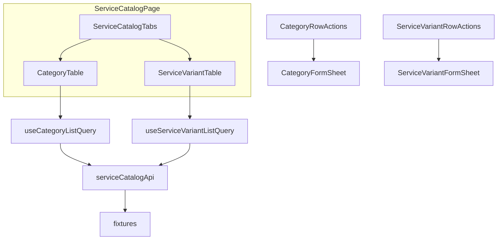

# Service Catalog Module Implementation Plan

## Current state

[`src/features/service-catalog/`](src/features/service-catalog/) is a 5-file stub: empty page, no-op API/hooks, empty locale JSON. Route `/services`, permissions (`services:view` / `services:manage`), lazy load, and sidebar nav are already wired.

Merchant profile [`ShopServicesTab.tsx`](src/features/merchant-management/components/ShopServicesTab.tsx) links to `/services` but uses separate `ShopService` fixtures — **out of scope** to unify; catalog gets its own domain types.

## Architecture



**Page shell:** [`ServiceCatalogPage.tsx`](src/features/service-catalog/components/ServiceCatalogPage.tsx) — header (`layout.pageStack`, `typography.sectionTitle`) + [`ServiceCatalogTabs.tsx`](src/features/service-catalog/components/ServiceCatalogTabs.tsx) with shadcn `Tabs` (`categories` | `variants`). Each tab owns independent loading/error/empty via `QuerySection`.

**Reference modules:** User/Staff list+CRUD ([`CustomerTable`](src/features/user-management/components/CustomerTable.tsx), [`StaffTable`](src/features/staff-management/components/StaffTable.tsx)), form sheets via [`FormSheetContent`](src/shared/components/sheet/FormSheetContent.tsx) + `formSheet` tokens.

---

## Phase 0 — Types and schemas

### [`types/category.ts`](src/features/service-catalog/types/category.ts)

```ts
export type CategoryStatus = 'active' | 'inactive';
export type ServiceCategoryListItem = {
  id;
  name;
  imageUrl?;
  status;
  variantCount; // computed at list read
};
export type ServiceCategoryListParams = ApiListParams & {
  status?: CategoryStatus;
  sortBy?: 'name' | 'variantCount' | 'status';
};
// CreateCategorySchema / UpdateCategorySchema (Zod 4): name min 1, imageUrl optional url, status enum
```

### [`types/service-variant.ts`](src/features/service-catalog/types/service-variant.ts)

```ts
export type ServiceGender = 'male' | 'female' | 'unisex';
export type ServiceVariantStatus = 'active' | 'inactive';
export type ServiceVariantListItem = {
  id;
  name;
  categoryId;
  categoryName;
  gender;
  durationMinutes;
  price;
  status;
  sortOrder;
  imageUrl?;
};
export type ServiceVariantListParams = ApiListParams & {
  categoryId?;
  gender?;
  status?;
  sortBy?: 'sortOrder' | 'name' | 'price' | 'durationMinutes';
};
// CreateServiceVariantSchema / UpdateServiceVariantSchema:
// name, categoryId, gender, durationMinutes (int positive), price (positive), description optional,
// imageUrl optional, status, sortOrder (int >= 0)
```

Update [`types/index.ts`](src/features/service-catalog/types/index.ts) barrel.

---

## Phase 1 — Fixtures

| File                                                                                                                | Contents                                                                                                                                                   |
| ------------------------------------------------------------------------------------------------------------------- | ---------------------------------------------------------------------------------------------------------------------------------------------------------- |
| [`api/fixtures/categories.fixture.ts`](src/features/service-catalog/api/fixtures/categories.fixture.ts)             | **6 seed rows** (not hardcoded-only): Hair, Beard, Massage, Spa, Skin Care, Nails — ids `cat-001`…`cat-006`, mixed status, optional placeholder `imageUrl` |
| [`api/fixtures/service-variants.fixture.ts`](src/features/service-catalog/api/fixtures/service-variants.fixture.ts) | **~18 variants** across categories; varied gender/duration/price/sortOrder; 1–2 inactive; optional image URLs                                              |

No inline mock data in components.

---

## Phase 2 — API layer

Rewrite [`api/service-catalog-api.ts`](src/features/service-catalog/api/service-catalog-api.ts) following [`staff-management-api.ts`](src/features/staff-management/api/staff-management-api.ts):

**Stores:** `let categoriesStore`, `let variantsStore` cloned from fixtures.

**Categories:**

- `getCategories(params)` — filter by search (name), status; sort; paginate; attach `variantCount` from variants store
- `getCategoryById(id)`, `createCategory`, `updateCategory`, `deleteCategory`
- **`deleteCategory` guard:** if any variant has `categoryId === id`, throw `Error('CATEGORY_HAS_VARIANTS')` (hook surfaces to UI)

**Variants:**

- `getServiceVariants(params)` — filter categoryId, gender, status, search (name/description); **default sort `sortOrder` asc** then name; paginate
- `getServiceVariantById`, `createServiceVariant`, `updateServiceVariant`, `deleteServiceVariant`
- `uploadServiceVariantImage(file)` — mock: return placeholder URL string (same pattern as gallery fixture URLs; no real upload)

JSDoc block listing future REST endpoints. Use shared `PaginatedResponse`, `ApiMutationResponse` from [`shared/types`](src/shared/types/).

Remove stub `fetchServiceCatalogPageList`.

---

## Phase 3 — TanStack Query hooks

Rewrite [`hooks/use-service-catalog-queries.ts`](src/features/service-catalog/hooks/use-service-catalog-queries.ts):

| Hook                                 | Query key                                                                                        |
| ------------------------------------ | ------------------------------------------------------------------------------------------------ |
| `useCategoryListQuery(params)`       | `['service-catalog', 'categories', 'list', params]`                                              |
| `useCategoryQuery(id)`               | `['service-catalog', 'categories', 'detail', id]`                                                |
| `useServiceVariantListQuery(params)` | `['service-catalog', 'variants', 'list', params]`                                                |
| `useServiceVariantQuery(id)`         | `['service-catalog', 'variants', 'detail', id]`                                                  |
| Category mutations                   | invalidate `categories` list (+ detail); **also invalidate variants list** (categoryName denorm) |
| Variant mutations                    | invalidate `variants` list + detail; **also categories list** (variantCount)                     |

`keepPreviousData` on both list queries. Delete category mutation: `onError` leaves dialog open (no navigate).

Remove stub hooks.

---

## Phase 4 — Categories UI

| Component                 | Pattern source     | Notes                                                                                                                                                       |
| ------------------------- | ------------------ | ----------------------------------------------------------------------------------------------------------------------------------------------------------- |
| `CategoryTable.tsx`       | `StaffTable`       | Add button (manage perm), search, status filter, pagination 20                                                                                              |
| `category-columns.tsx`    | `staff-columns`    | Name (optional thumbnail if `imageUrl`), variantCount, status badge, actions                                                                                |
| `CategoryStatusBadge.tsx` | `StaffStatusBadge` | active/inactive                                                                                                                                             |
| `CategoryFilters.tsx`     | `StaffFilters`     | Status select + `statusFilterToParam`                                                                                                                       |
| `CategoryMobileCard.tsx`  | `StaffMobileCard`  |                                                                                                                                                             |
| `CategoryRowActions.tsx`  | `StaffRowActions`  | Edit → sheet; Delete → `ConfirmDialog` — **disabled/hidden when `variantCount > 0`**, show `confirm.deleteBlocked` copy if attempted via API error fallback |
| `CategoryFormSheet.tsx`   | `StaffFormSheet`   | Create + edit modes; fields: name, optional image URL input (or single-image dropzone preview), status select; `FormSheetContent` + RHF + Zod               |

---

## Phase 5 — Service Variants UI

| Component                       | Pattern source              | Notes                                                                                                                                                                                                                |
| ------------------------------- | --------------------------- | -------------------------------------------------------------------------------------------------------------------------------------------------------------------------------------------------------------------- |
| `ServiceVariantTable.tsx`       | `StaffTable`                | Add button, search, 3 filters (category/gender/status), default sort `sortOrder`                                                                                                                                     |
| `service-variant-columns.tsx`   | `merchant-service-columns`  | Name, category, gender, duration (`N min`), price (`formatInr`), status, sortOrder, actions                                                                                                                          |
| `ServiceVariantStatusBadge.tsx` | status badge pattern        |                                                                                                                                                                                                                      |
| `ServiceVariantFilters.tsx`     | `StaffFilters`              | Category options from `useCategoryListQuery({ pageSize: 100 })` or fixture constant export                                                                                                                           |
| `ServiceVariantMobileCard.tsx`  | mobile card pattern         |                                                                                                                                                                                                                      |
| `ServiceVariantRowActions.tsx`  | `StaffRowActions`           | Edit sheet, delete confirm                                                                                                                                                                                           |
| `ServiceVariantImageField.tsx`  | `ShopGalleryTab` + dropzone | Single image: `ImageUploadDropzone` (maxFiles=1) + preview; stores URL via form field / mock upload mutation                                                                                                         |
| `ServiceVariantFormSheet.tsx`   | `StaffFormSheet`            | All fields; category `Select` populated from categories query; gender select; duration/price/sortOrder number inputs; description textarea; status select; Switch **not** used (select matches staff status pattern) |

**Sort order:** No drag-reorder exists in codebase — use numeric `sortOrder` input. List API sorts by `sortOrder` asc by default.

**Currency:** [`formatInr`](src/features/dashboard/lib/formatters.ts) in columns; price stored as number (INR).

---

## Phase 6 — Page and tabs

- [`ServiceCatalogPage.tsx`](src/features/service-catalog/components/ServiceCatalogPage.tsx) — header + `ServiceCatalogTabs`
- [`ServiceCatalogTabs.tsx`](src/features/service-catalog/components/ServiceCatalogTabs.tsx) — `Tabs` with lazy-mount active panel only (match [`StaffProfileTabs`](src/features/staff-management/components/StaffProfileTabs.tsx) mount pattern)

[`index.ts`](src/features/service-catalog/index.ts) — export `ServiceCatalogPage` only (unchanged public API).

No new routes or top-level `src/` folders.

---

## Phase 7 — i18n

Populate [`src/locales/en/service-catalog.json`](src/locales/en/service-catalog.json) and [`src/locales/ml/service-catalog.json`](src/locales/ml/service-catalog.json):

- `page`, `tabs.categories`, `tabs.variants`
- `columns.*` (both sub-modules)
- `list.*`, `status.*`, `gender.*`
- `actions.*`, `confirm.*` (include `confirm.deleteBlocked` for category with variants)
- `form.*`, `empty.*`, `errors.*`, `pagination.*`

Namespace already registered in [`i18n.ts`](src/shared/lib/i18n.ts).

---

## Phase 8 — Verification

```bash
pnpm exec tsc --noEmit && pnpm lint && pnpm build
```

Manual smoke: `/services` → both tabs; category CRUD; delete blocked when variants linked; variant CRUD with filters; form sheets responsive (sticky header/footer); manage actions hidden without `services:manage`.

---

## Files summary

**New (~22):** types (2), fixtures (2), ~16 components, image field helper

**Modified (~6):** `service-catalog-api.ts`, `use-service-catalog-queries.ts`, `ServiceCatalogPage.tsx`, `types/index.ts`, en/ml locale JSON; remove/replace stub types if needed

**Reuse (no changes):** `DataTable`, `QuerySection`, `FormSheetContent`, `ConfirmDialog`, `ActionMenu`, `ImageUploadDropzone`, `SortableHeader`, `formatInr`, `PERMISSIONS.services.*`

**Not in scope:** Backend integration, drag reorder, merchant `ShopService` unification, media-library module
