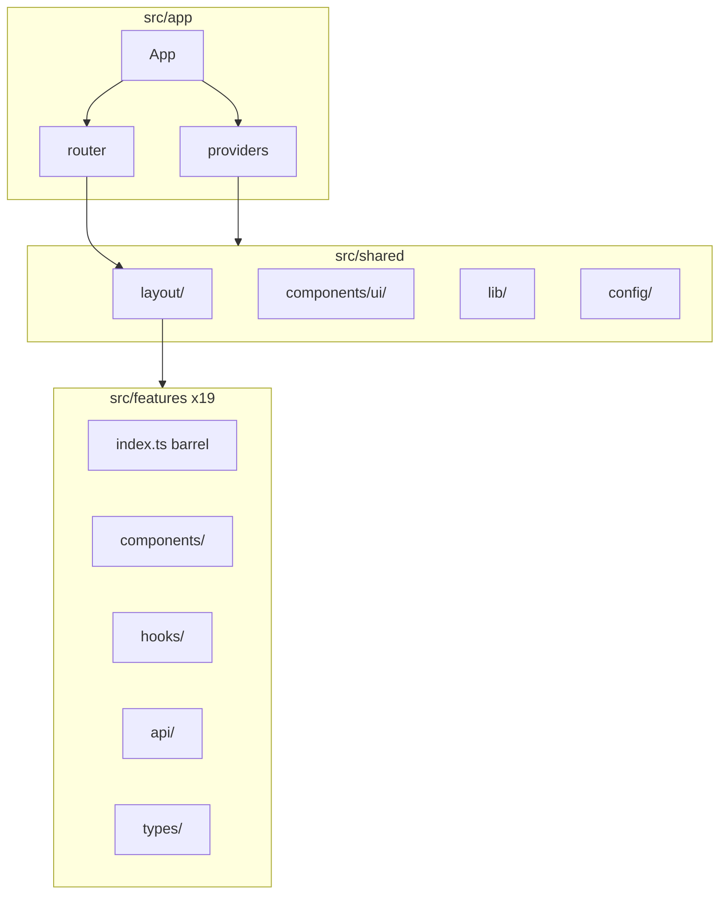
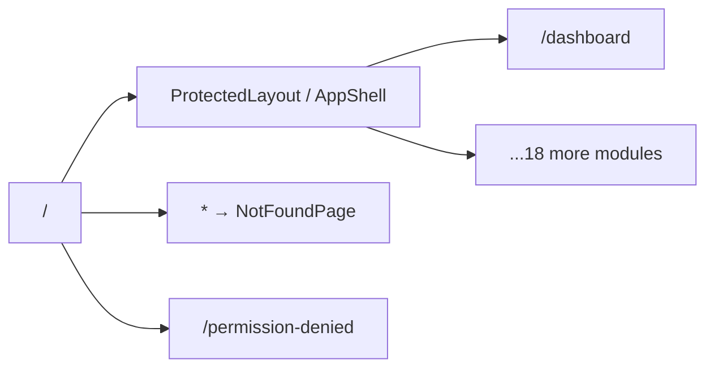

# StyleUp ERP Dashboard — Scaffolding Plan

> **For agentic workers:** Execute steps in order; run the verification checklist after each major phase.

**Goal:** Bootstrap [styleUpERP-dashboard](.) as a strict-mode Vite + React + TS monolith frontend with feature-based architecture, all configs, and empty placeholder exports — ready for feature implementation.

**Architecture:** Feature folders own `components/`, `hooks/`, `api/`, `types/`, and barrel `index.ts`. Cross-cutting concerns live under `src/shared/` (UI, layout, lib, config). App shell wires providers (Query, CASL, Theme, Merchant, i18n, Sentry stub) and lazy-loaded routes behind a protected layout.

**Tech stack:** pnpm, Vite 8, React 19, TypeScript (strict), Tailwind CSS v4 (CSS-first, `@tailwindcss/vite`), shadcn/ui (CLI), TanStack Query/Table/Virtual, Zustand, react-router-dom, CASL, axios, i18next, Sentry (placeholder).

**Tailwind version decision:** use shadcn/ui's current CLI default (Tailwind v4, CSS-first config) unless a specific dependency forces v3.

**Note on module count:** Spec says "18 total" but lists **19** feature folders — this plan implements all **19** folders exactly as specified in Step 3.

---

## Phase 1 — Project Init

### 1.1 Scaffold Vite template in repo root

The repo may contain [README.md](README.md) or other files. Scaffold in-place without interactive prompts:

```bash
# 1. Preserve README if present (Phase 7 rewrites it)
mv README.md /tmp/README.md.bak 2>/dev/null || true

# 2. Non-interactive scaffold (create-vite v8+: --overwrite + --no-interactive)
pnpm create vite@latest . --template react-ts --overwrite --no-interactive

# 3. Restore README before Phase 7 rewrite
mv /tmp/README.md.bak README.md 2>/dev/null || true
```

Verify with `pnpm create vite@latest --help` if flags differ on your CLI version. Do **not** assume `--yes` or `--force` — the current flag is `--overwrite`.

### 1.2 TypeScript path aliases

Update [tsconfig.json](tsconfig.json), [tsconfig.app.json](tsconfig.app.json), and [tsconfig.node.json](tsconfig.node.json):

- `"strict": true` (verify/enforce)
- `"baseUrl": "."`
- `"paths": { "@/*": ["./src/*"] }` in both root and app configs
- `"types": ["vite/client", "vite-plugin-svgr/client"]` in app config after SVGR install

### 1.3 Vite config foundation

Create [vite.config.ts](vite.config.ts) with:

```ts
import react from '@vitejs/plugin-react';
import svgr from 'vite-plugin-svgr';
import tsconfigPaths from 'vite-tsconfig-paths';
import { defineConfig } from 'vite';

export default defineConfig({
  plugins: [react(), tsconfigPaths(), svgr()],
});
```

No manual `resolve.alias` — `vite-tsconfig-paths` reads from tsconfig (per user requirement).

**Prerequisite:** Node.js 20.19+ or 22.12+ (Vite 8 requirement).

---

## Phase 2 — Dependencies (exact pins)

Install with `--save-exact` (no `^`/`~` in [package.json](package.json)). After install, generate [VERSIONS.md](VERSIONS.md) from `pnpm list --depth 0` output.

### 2.0 FullCalendar + React 19 compatibility check (run before bulk install)

Before the Phase 2.2 batched install, verify FullCalendar peer dependencies against React 19:

```bash
mkdir -p /tmp/fc-peer-check && cd /tmp/fc-peer-check
pnpm init
pnpm add react@19 react-dom@19 --save-exact
pnpm add @fullcalendar/react@latest --save-exact
pnpm info @fullcalendar/react peerDependencies
```

**Decision rules:**

- If `@fullcalendar/react@latest` peer range includes React 19 (e.g. `^16.7.0 || ^17 || ^18 || ^19` on v6.1.14+): pin that version in Phase 2.2.
- If it does **not** yet support React 19: either pin the newest version that does, or add a `pnpm.overrides` entry (document which approach and why in [VERSIONS.md](VERSIONS.md)).
- Add `@fullcalendar/core` **explicitly** to the install list (do not assume transitive resolution). After install, confirm whether additional direct `@fullcalendar/*` packages are required for the pinned version (v6 plugin packages peer-depend on `@fullcalendar/core@~6.x`; v7 may differ — verify at install time).

Record the chosen FullCalendar version and any overrides in [VERSIONS.md](VERSIONS.md).

### 2.1 Core + routing + build

| Category | Packages                                                                                        |
| -------- | ----------------------------------------------------------------------------------------------- |
| Runtime  | `react`, `react-dom`                                                                            |
| Router   | `react-router-dom`                                                                              |
| Build    | `typescript`, `vite`, `@vitejs/plugin-react`, `@types/node`, `@types/react`, `@types/react-dom` |

### 2.2 Data, forms, UI, charts, calendar, real-time, auth, HTTP, i18n, utils

Install all packages from the user spec in a single batched `pnpm add` / `pnpm add -D` pass:

- **Data:** `@tanstack/react-query`, `@tanstack/react-query-devtools`, `@tanstack/react-table`, `@tanstack/react-virtual`, `zustand`
- **Forms:** `react-hook-form`, `zod`, `@hookform/resolvers`
- **UI base:** `tailwindcss`, `postcss`, `autoprefixer`, `tailwindcss-animate`, `class-variance-authority`, `clsx`, `tailwind-merge`, `lucide-react`, `cmdk`
- **Charts:** `recharts`
- **Calendar:** `@fullcalendar/core`, `@fullcalendar/react`, `@fullcalendar/daygrid`, `@fullcalendar/timegrid`, `@fullcalendar/resource-timeline`, `@fullcalendar/interaction` (versions per §2.0)
- **Real-time:** `socket.io-client`
- **Auth:** `@casl/ability`, `@casl/react`
- **HTTP:** `axios`
- **i18n:** `react-i18next`, `i18next`, `i18next-browser-languagedetector`
- **Utils:** `date-fns`, `browser-image-compression`, `react-dropzone`
- **Dev:** `eslint`, `@eslint/js`, `typescript-eslint`, `eslint-plugin-react-hooks`, `eslint-plugin-react-refresh`, `globals`, `prettier`, `eslint-config-prettier`, `vite-plugin-svgr`, `vite-tsconfig-paths`
- **Errors:** `@sentry/react`

`@tanstack/react-query-devtools` → devDependencies.

> **Phase 3 supersedes v3 Tailwind packages:** During Phase 2.2, skip `postcss`, `autoprefixer`, and `tailwindcss-animate`. Install the Tailwind v4 stack in Phase 3 instead. Keep `tailwindcss`, `class-variance-authority`, `clsx`, `tailwind-merge`, `lucide-react`, `cmdk`.

### 2.3 VERSIONS.md

Document every direct dependency with exact semver from lockfile/`pnpm list`.

---

## Phase 3 — Tailwind v4 + shadcn/ui + Theme CSS

**Tailwind version decision:** use shadcn/ui's current CLI default (Tailwind v4, CSS-first config) unless a specific dependency forces v3.

### 3.0 Capture real CLI output (mandatory — do not hand-write from memory)

Before configuring this project, run shadcn init in a scratch directory and copy its actual output:

```bash
mkdir -p /tmp/shadcn-scratch && cd /tmp/shadcn-scratch
pnpm create vite@latest . --template react-ts --overwrite --no-interactive
pnpm add tailwindcss @tailwindcss/vite tw-animate-css --save-exact
pnpm add -D tw-animate-css --save-exact   # if CLI places it in devDependencies
pnpm dlx shadcn@latest init --help        # record available --style / --base flags
pnpm dlx shadcn@latest init               # follow prompts; record chosen style + reason
```

From the scratch output, capture verbatim:

- Generated [components.json](components.json) (full file)
- Generated CSS file(s) — note whether CLI writes `src/index.css` or another path
- Whether `tailwind.config.ts` was created (v4 projects typically have **no** config file; `tailwind.config` in `components.json` is `""`)

Use that captured output as the source of truth for this project. Adjust only paths/aliases per §3.4.

**Reference shape** (from [shadcn manual install docs](https://ui.shadcn.com/docs/installation/manual), Jul 2026 — replace with scratch output at execution time):

```json
{
  "$schema": "https://ui.shadcn.com/schema.json",
  "style": "<CLI-chosen-style>",
  "rsc": false,
  "tsx": true,
  "tailwind": {
    "config": "",
    "css": "src/styles/globals.css",
    "baseColor": "neutral",
    "cssVariables": true,
    "prefix": ""
  },
  "aliases": {
    "components": "@/shared/components",
    "utils": "@/shared/lib/utils",
    "ui": "@/shared/components/ui",
    "lib": "@/shared/lib",
    "hooks": "@/shared/hooks"
  },
  "iconLibrary": "lucide"
}
```

Do **not** hardcode `"style": "new-york"`. Run `pnpm dlx shadcn@latest init --help` and record available styles at execution time (e.g. `new-york`, `base-nova`, preset-driven options). Document the chosen style with a one-line reason (e.g. "used CLI default").

### 3.1 Tailwind v4 + Vite plugin (no PostCSS config)

Install (exact pins):

```bash
pnpm add tailwindcss @tailwindcss/vite --save-exact
pnpm add -D tw-animate-css --save-exact
```

- **Do not** create [postcss.config.js](postcss.config.js) with `tailwindcss` + `autoprefixer`.
- **Do not** install `tailwindcss-animate` (deprecated March 2025); use `tw-animate-css` instead.
- **Do not** hand-author [tailwind.config.ts](tailwind.config.ts) unless the scratch init in §3.0 generated one — check actual CLI output before assuming its presence.

Update [vite.config.ts](vite.config.ts) — add `@tailwindcss/vite` alongside existing plugins:

```ts
import tailwindcss from '@tailwindcss/vite';
import react from '@vitejs/plugin-react';
import svgr from 'vite-plugin-svgr';
import tsconfigPaths from 'vite-tsconfig-paths';
import { defineConfig } from 'vite';

export default defineConfig({
  plugins: [react(), tsconfigPaths(), svgr(), tailwindcss()],
});
```

### 3.2 CSS-first theme in globals.css

Create [src/styles/globals.css](src/styles/globals.css) using the structure from §3.0 scratch output. Expected v4 pattern:

```css
@import 'tailwindcss';
@import 'tw-animate-css';

/* @theme inline block + shadcn CSS variables — copy from scratch init output */
@theme inline {
  /* semantic tokens mapped to CSS variables */
}

:root {
  /* shadcn neutral palette tokens (OKLCH in current CLI) */
}

.dark {
  /* dark mode tokens */
}

/*
 * White-label prep (structure only, no logic):
 * [data-merchant-theme] {
 *   --merchant-primary: ...;
 *   --merchant-accent: ...;
 * }
 */

@layer base {
  * {
    @apply border-border;
  }
  body {
    @apply bg-background text-foreground;
  }
}
```

- No separate [src/styles/tailwind.css](src/styles/tailwind.css) with `@tailwind base/components/utilities` — v4 uses `@import "tailwindcss"`.
- White-label prep: commented `--merchant-*` override block lives inside the CSS variable / `@theme inline` section, not a JS config file.

Import globals in [src/main.tsx](src/main.tsx).

### 3.3 shadcn init (CLI — do not hand-roll components)

Ensure [src/shared/lib/utils.ts](src/shared/lib/utils.ts) exists (CLI may create under default path — move/reconcile to `@/shared/lib/utils`).

Run init in the project (after §3.1 Tailwind v4 is wired):

```bash
pnpm dlx shadcn@latest init
```

At execution time:

1. Run `pnpm dlx shadcn@latest init --help` — record available style/base/preset flags.
2. Choose style interactively (or via documented non-interactive flags if supported); record choice + one-line reason.
3. Base color: **neutral** (Graphite-compatible; tokens swappable later).
4. CSS variables: **yes**.
5. After init, patch [components.json](components.json) **aliases only** to project paths (§3.0 reference). Do not hand-edit the `tailwind` block — it must match CLI output.

Add button for verification:

```bash
pnpm dlx shadcn@latest add button
```

Ensure [src/shared/lib/utils.ts](src/shared/lib/utils.ts) exports `cn()` via `clsx` + `tailwind-merge`.

---

## Phase 4 — Folder Structure

Create the full tree below. Every `.ts`/`.tsx` file is an **empty shell** with correct exports/types — no logic, no mock data.



### 4.1 Feature modules (19)

Each under `src/features/<kebab-name>/`:

| Folder                 | Route slug (protected) |
| ---------------------- | ---------------------- |
| `dashboard`            | `/dashboard`           |
| `user-management`      | `/users`               |
| `merchant-management`  | `/merchants`           |
| `staff-management`     | `/staff`               |
| `service-catalog`      | `/services`            |
| `package-management`   | `/packages`            |
| `booking-management`   | `/bookings`            |
| `calendar-scheduling`  | `/calendar`            |
| `payments`             | `/payments`            |
| `promotions`           | `/promotions`          |
| `reviews`              | `/reviews`             |
| `messaging`            | `/messaging`           |
| `notifications`        | `/notifications`       |
| `loyalty`              | `/loyalty`             |
| `media-library`        | `/media`               |
| `reports-analytics`    | `/reports`             |
| `system-configuration` | `/settings`            |
| `role-permission`      | `/roles`               |
| `audit-logs`           | `/audit-logs`          |

**Per feature (identical):**

```
components/
  <FeatureName>Page.tsx     # empty page shell (named export)
hooks/
  use-<feature>-queries.ts  # useQuery/useMutation signature stubs, no fetchFn body
api/
  <feature>-api.ts          # empty exported functions returning Promise<void> or typed placeholders
types/
  index.ts                  # empty interfaces / type aliases
index.ts                    # barrel: export { XPage } from './components/...'
```

Example page shell pattern:

```tsx
export function DashboardPage(): JSX.Element {
  return <div data-testid="dashboard-page" />;
}
```

Dashboard page additionally renders shadcn `<Button>` to satisfy verification #7.

### 4.2 Shared layer

| Path                                                                                                                 | Purpose                                                         |
| -------------------------------------------------------------------------------------------------------------------- | --------------------------------------------------------------- |
| [src/shared/components/layout/AppShell.tsx](src/shared/components/layout/AppShell.tsx)                               | `<Outlet />` wrapper shell                                      |
| `Sidebar.tsx`, `Header.tsx`, `Breadcrumbs.tsx`                                                                       | Empty layout shells with typed props                            |
| [src/shared/components/data-table/DataTable.tsx](src/shared/components/data-table/DataTable.tsx)                     | Generic TanStack Table wrapper shell                            |
| [src/shared/components/charts/ChartContainer.tsx](src/shared/components/charts/ChartContainer.tsx)                   | Recharts wrapper shell                                          |
| [src/shared/components/command-palette/CommandPalette.tsx](src/shared/components/command-palette/CommandPalette.tsx) | cmdk shell                                                      |
| [src/shared/components/empty-state/EmptyState.tsx](src/shared/components/empty-state/EmptyState.tsx)                 | Empty state shell                                               |
| [src/shared/components/loading/Skeleton.tsx](src/shared/components/loading/Skeleton.tsx), `PageLoader.tsx`           | Loading shells                                                  |
| [src/shared/components/error-boundary/ErrorBoundary.tsx](src/shared/components/error-boundary/ErrorBoundary.tsx)     | Class or wrapper boundary shell                                 |
| [src/shared/hooks/use-permissions.ts](src/shared/hooks/use-permissions.ts)                                           | Returns CASL ability stub                                       |
| `use-debounce.ts`, `use-media-query.ts`                                                                              | Hook signature stubs                                            |
| [src/shared/lib/axios.ts](src/shared/lib/axios.ts)                                                                   | `axios.create()` + empty request/response interceptors          |
| [src/shared/lib/query-client.ts](src/shared/lib/query-client.ts)                                                     | Exported `QueryClient` instance                                 |
| [src/shared/lib/casl-ability.ts](src/shared/lib/casl-ability.ts)                                                     | Empty `Ability` factory                                         |
| [src/shared/lib/constants.ts](src/shared/lib/constants.ts)                                                           | App name constants                                              |
| [src/shared/lib/i18n.ts](src/shared/lib/i18n.ts)                                                                     | i18next init (loads namespaces, no translations)                |
| [src/shared/lib/merchant-context.tsx](src/shared/lib/merchant-context.tsx)                                           | Context + Provider stub                                         |
| [src/shared/lib/merchant-store.ts](src/shared/lib/merchant-store.ts)                                                 | Zustand slice: `{ merchantId: string \| null }` + no-op setters |
| [src/shared/lib/sentry.ts](src/shared/lib/sentry.ts)                                                                 | `initSentry()` gated on `VITE_SENTRY_DSN`                       |
| [src/shared/types/common.ts](src/shared/types/common.ts), `api.ts`                                                   | Base type placeholders                                          |
| [src/shared/config/env.ts](src/shared/config/env.ts)                                                                 | Zod-validated `import.meta.env`                                 |
| [src/shared/config/routes.ts](src/shared/config/routes.ts)                                                           | Route path constants                                            |
| [src/shared/config/permissions.ts](src/shared/config/permissions.ts)                                                 | Permission key constants                                        |
| [src/shared/config/feature-flags.ts](src/shared/config/feature-flags.ts)                                             | Flag key constants                                              |

### 4.3 Locales

Mirror namespace per module in both locales:

- [src/locales/en/common.json](src/locales/en/common.json) + 19 module JSON files → `{}`
- [src/locales/ml/](src/locales/ml/) — identical filenames, `{}`

### 4.4 Assets

- [src/assets/icons/.gitkeep](src/assets/icons/.gitkeep)
- [src/assets/images/.gitkeep](src/assets/images/.gitkeep)

### 4.5 Entry files

- [src/main.tsx](src/main.tsx): import globals, call `initSentry()`, render `<App />`
- Remove default Vite boilerplate (`App.css`, unused assets)

---

## Phase 5 — App Wiring

### 5.1 [src/app/providers.tsx](src/app/providers.tsx)

Compose (empty/stub logic only):

```
QueryClientProvider
  → I18nextProvider (or init side-effect)
  → AbilityContext (CASL)
  → MerchantProvider
  → ThemeProvider (sets class strategy on <html>, default "light")
  → {children}
ReactQueryDevtools (dev only)
```

### 5.2 [src/app/router.tsx](src/app/router.tsx)



- `createBrowserRouter` with lazy imports from each feature `index.ts`
- Protected parent route wraps `AppShell` + `<Outlet />`
- Index redirect: `/` → `/dashboard`
- [src/app/pages/NotFoundPage.tsx](src/app/pages/NotFoundPage.tsx), `PermissionDeniedPage.tsx` — empty shells
- All lazy routes wrapped in `<Suspense fallback={<PageLoader />}>`

### 5.3 [src/app/App.tsx](src/app/App.tsx)

```tsx
export default function App() {
  return (
    <Providers>
      <RouterProvider router={router} />
    </Providers>
  );
}
```

### 5.4 Absolute import smoke test

In [src/shared/lib/constants.ts](src/shared/lib/constants.ts):

```ts
import { cn } from '@/shared/lib/utils';
export const APP_NAME = 'StyleUp ERP';
export const cnHelper = cn; // re-export proves @/ resolves
```

---

## Phase 6 — Config Files

| File                                 | Key settings                                                                                               |
| ------------------------------------ | ---------------------------------------------------------------------------------------------------------- |
| [.env.example](.env.example)         | `VITE_API_URL`, `VITE_SOCKET_URL`, `VITE_SENTRY_DSN`, `VITE_APP_ENV`, documented comments, no secrets      |
| [eslint.config.js](eslint.config.js) | Flat config: TS recommended, react-hooks, react-refresh, `@typescript-eslint/no-unused-vars` error, strict |
| [.prettierrc](.prettierrc)           | semi, singleQuote, trailingComma es5, printWidth 100                                                       |
| [.gitignore](.gitignore)             | `node_modules`, `dist`, `.env`, `.env.local`, `.env.*.local`                                               |
| [components.json](components.json)   | From shadcn init (Phase 3) — must match CLI output, aliases patched only                                   |
| [index.html](index.html)             | Title: "StyleUp ERP"                                                                                       |

Add scripts to [package.json](package.json):

```json
{
  "scripts": {
    "dev": "vite",
    "build": "tsc -b && vite build",
    "lint": "eslint .",
    "preview": "vite preview",
    "format": "prettier --write ."
  }
}
```

---

## Phase 7 — README

Rewrite [README.md](README.md) with:

- Project name + one-line description (StyleQuest salon ERP admin)
- Prerequisites (Node 20.19+, pnpm)
- Setup: `pnpm install`, copy `.env.example` → `.env`
- Commands: `pnpm dev`, `pnpm build`, `pnpm lint`, `pnpm preview`
- Folder structure overview (app / features / shared / locales)
- Note: backend is separate; no API wiring in scaffold

---

## Phase 8 — Verification Checklist

Run sequentially and fix until all pass:

1. `pnpm install` — zero peer dependency errors
2. `pnpm dev` — server starts; browser shows AppShell with sidebar/header placeholders
3. `pnpm build` — zero TypeScript errors
4. `pnpm lint` — zero errors
5. Script or `find` confirms 19 feature folders × 5 sub-items (`components`, `hooks`, `api`, `types`, `index.ts`)
6. `@/` import in `constants.ts` compiles (covered by build)
7. Dashboard renders shadcn Button without console errors
8. Dark mode: `document.documentElement.classList.add('dark')` applies dark CSS variables (verify in DevTools computed styles)
9. Print final tree: `find src -type f | sort` and paste `pnpm list --depth 0` into terminal output / update VERSIONS.md
10. **Tailwind v4 active:** no `tailwind.config.ts` present (unless CLI generated one in §3.0); [src/styles/globals.css](src/styles/globals.css) contains `@import "tailwindcss"` and an `@theme inline` block
11. **`tw-animate-css` installed; `tailwindcss-animate` NOT in package.json**; no [postcss.config.js](postcss.config.js) with manual Tailwind PostCSS plugin
12. **`@fullcalendar/react` peer dependency warnings are zero** on `pnpm install` (per §2.0 decision)
13. **Scaffold ran non-interactively:** Phase 1.1 used `--overwrite --no-interactive`; README.md restored from `/tmp/README.md.bak` before Phase 7
14. **`components.json` matches actual CLI-generated output** from §3.0 scratch run (not a hand-written guess); only `aliases` were patched to `@/shared/...` paths

---

## File Count Estimate

~**180–220 files** (mostly empty stubs + locale JSON + configs). Use a shell loop to generate repetitive feature boilerplate to avoid manual errors.

## Out of Scope (explicit)

- No API calls, mock data, auth flows, or Redux
- No backend references or NestJS integration
- No feature business logic beyond empty component/query shells
- No theming runtime logic (CSS variable structure only)
