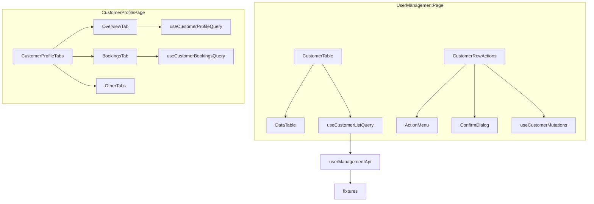

# User Management Module Implementation Plan

> **For agentic workers:** REQUIRED SUB-SKILL: Use superpowers:subagent-driven-development (recommended) or superpowers:executing-plans to implement this plan task-by-task.

**Goal:** Deliver a fully typed Customer List (`/users`) and Customer Profile detail view (`/users/:customerId`) with 7 lazy-loaded tabs, server-side pagination/sorting/filtering, row actions with confirmation dialogs, and CASL-gated destructive actions.

**Architecture:** Follow the dashboard recent-activity stack as the primary reference ([`RecentActivityTable.tsx`](src/features/dashboard/components/RecentActivityTable.tsx), [`dashboard-api.ts`](src/features/dashboard/api/dashboard-api.ts)). Fill shared infrastructure gaps first (missing shadcn primitives, ActionMenu, ConfirmDialog, DataTable sorting). Feature code stays in [`src/features/user-management/`](src/features/user-management/) with fixture-backed API functions until backend endpoints exist. Profile tabs use **internal `useState`** (matching [`RecentActivityPanel.tsx`](src/features/dashboard/components/RecentActivityPanel.tsx)) — no URL-synced tabs in this codebase today.

**Tech Stack:** React 19, TanStack Query v5, TanStack Table v8, shadcn/ui (radix-nova), CASL, react-i18next, `useResponsive` + [`src/theme/responsive.ts`](src/theme/responsive.ts).

---

## Current State

| Area                                                                   | Status                                                         |
| ---------------------------------------------------------------------- | -------------------------------------------------------------- |
| [`src/features/user-management/`](src/features/user-management/)       | Scaffold only — empty page, stub API/hooks/types               |
| Route `/users`                                                         | Wired in [`router.tsx`](src/app/router.tsx)                    |
| Detail route                                                           | **Missing** — no `:id` routes anywhere                         |
| `DataTable`                                                            | Pagination + search + mobile cards work; **no server sorting** |
| `ActionMenu`, `ConfirmDialog`, `Avatar`, `DropdownMenu`, `AlertDialog` | **Not present**                                                |
| CASL                                                                   | Empty ability — `Can` checks would hide all manage actions     |
| Fixtures pattern                                                       | Only dashboard is fully built                                  |



---

## Phase 0 — Shared Infrastructure (prerequisites)

These gaps block the feature; build once in `shared/` for reuse by future modules.

### 0a. Add shadcn primitives

Run (pnpm only):

```bash
pnpm dlx shadcn@latest add avatar dropdown-menu alert-dialog
```

Creates:

- [`src/shared/components/ui/avatar.tsx`](src/shared/components/ui/avatar.tsx)
- [`src/shared/components/ui/dropdown-menu.tsx`](src/shared/components/ui/dropdown-menu.tsx)
- [`src/shared/components/ui/alert-dialog.tsx`](src/shared/components/ui/alert-dialog.tsx)

### 0b. Shared `ActionMenu`

**Create:** [`src/shared/components/action-menu/ActionMenu.tsx`](src/shared/components/action-menu/ActionMenu.tsx)

```tsx
export type ActionMenuItem = {
  id: string;
  label: string;
  icon?: LucideIcon;
  onSelect: () => void;
  variant?: 'default' | 'destructive';
  disabled?: boolean;
  hidden?: boolean;
};
export type ActionMenuProps = {
  items: ActionMenuItem[];
  triggerLabel?: string;
};
```

- Trigger: `Button variant="ghost" size="icon"` + `MoreHorizontal`
- Renders visible items via `DropdownMenu` / `DropdownMenuItem`
- `hidden` items filtered out (for CASL-wrapped usage from parent)

### 0c. Shared `ConfirmDialog`

**Create:** [`src/shared/components/confirm-dialog/ConfirmDialog.tsx`](src/shared/components/confirm-dialog/ConfirmDialog.tsx)

Controlled wrapper over `AlertDialog`:

- Props: `open`, `onOpenChange`, `title`, `description`, `confirmLabel`, `cancelLabel`, `variant?: 'default' | 'destructive'`, `onConfirm`, `isPending?`
- Destructive variant styles confirm button with `variant="destructive"`

### 0d. Extend `DataTable` for server-side sorting

**Modify:** [`src/shared/components/data-table/DataTable.tsx`](src/shared/components/data-table/DataTable.tsx)

Add optional props (backward-compatible — dashboard unchanged):

```tsx
sorting?: SortingState;
onSortingChange?: OnChangeFn<SortingState>;
manualSorting?: boolean; // default false; customer list passes true
```

Wire into `useReactTable` state. Add a small exported helper:

**Create:** [`src/shared/components/data-table/SortableHeader.tsx`](src/shared/components/data-table/SortableHeader.tsx)

- Renders column label + `ArrowUpDown` icon; toggles asc/desc on click
- Used in feature column defs via `header: ({ column }) => <SortableHeader column={column} label={t('...')} />`

### 0e. Shared `QuerySection` (generalize `DashboardSection`)

**Create:** [`src/shared/components/query/QuerySection.tsx`](src/shared/components/query/QuerySection.tsx)

Same API as [`DashboardSection.tsx`](src/features/dashboard/components/DashboardSection.tsx) but uses `useTranslation('common')` for generic error text.

**Add keys** to both [`src/locales/en/common.json`](src/locales/en/common.json) and [`src/locales/ml/common.json`](src/locales/ml/common.json):

```json
"errors": { "loadFailed": "Failed to load data." }
```

Refactor dashboard to import shared `QuerySection` (optional follow-up in same PR to avoid duplication).

### 0f. Move `TruncatedText` to shared

**Move:** [`src/features/dashboard/components/TruncatedText.tsx`](src/features/dashboard/components/TruncatedText.tsx) → [`src/shared/components/text/TruncatedText.tsx`](src/shared/components/text/TruncatedText.tsx)

Update dashboard imports (`activity-columns.tsx`, `RecentActivityList.tsx`). User-management imports from shared.

### 0g. Permission guard + dev CASL stub

**Create:** [`src/app/guards/RequirePermission.tsx`](src/app/guards/RequirePermission.tsx)

```tsx
// Wraps <Outlet /> or children; redirects to ROUTES.permissionDenied if !ability.can(action, subject)
```

**Modify:** [`src/shared/lib/casl-ability.ts`](src/shared/lib/casl-ability.ts)

Add temporary dev rules granting all keys from [`permissions.ts`](src/shared/config/permissions.ts) until auth is wired (commented `TODO: replace with role-based rules`). Without this, manage actions and route guards are untestable.

---

## Phase 1 — Types

**Replace** [`src/features/user-management/types/index.ts`](src/features/user-management/types/index.ts) barrel.

### [`types/customer.ts`](src/features/user-management/types/customer.ts)

```ts
export type CustomerStatus = 'active' | 'suspended' | 'pending';

export type CustomerListItem = {
  id: string;
  avatarUrl?: string;
  name: string;
  email: string;
  phone: string;
  country: string;
  xp: number;
  level: number;
  status: CustomerStatus;
  lastLoginAt: string | null; // ISO
};

export type CustomerListParams = ApiListParams & {
  status?: CustomerStatus;
  sortBy?: keyof Pick<
    CustomerListItem,
    'name' | 'email' | 'xp' | 'level' | 'lastLoginAt' | 'status'
  >;
  sortOrder?: 'asc' | 'desc';
};

export type CustomerListResponse = PaginatedResponse<CustomerListItem>;
```

### [`types/customer-profile.ts`](src/features/user-management/types/customer-profile.ts)

```ts
export type CustomerProfile = CustomerListItem & {
  joinDate: string;
  totalBookings: number;
  totalSpent: number;
  reviewCount: number;
  loyaltyPoints: number;
};
```

### [`types/customer-tabs.ts`](src/features/user-management/types/customer-tabs.ts)

Define tab union + per-tab row types and params:

```ts
export type CustomerProfileTab =
  'overview' | 'bookings' | 'payments' | 'reviews' | 'notifications' | 'loyalty' | 'audit-logs';

export type CustomerBooking = {
  id: string;
  shopName: string;
  serviceName: string;
  status: string;
  scheduledAt: string;
  amount: number;
};
export type CustomerPayment = {
  id: string;
  amount: number;
  method: string;
  status: string;
  paidAt: string;
};
export type CustomerReview = {
  id: string;
  shopName: string;
  rating: number;
  comment: string;
  createdAt: string;
};
export type CustomerNotification = {
  id: string;
  channel: string;
  title: string;
  sentAt: string;
  status: string;
};
export type CustomerLoyaltyEntry = {
  id: string;
  type: 'earn' | 'redeem';
  points: number;
  description: string;
  createdAt: string;
};
export type CustomerAuditLog = {
  id: string;
  action: string;
  actor: string;
  createdAt: string;
};

export type CustomerTabListParams = ApiListParams; // page, pageSize, search
```

### Update [`src/shared/types/api.ts`](src/shared/types/api.ts)

Extend `ApiListParams` with optional sort fields (shared across features):

```ts
sortBy?: string;
sortOrder?: 'asc' | 'desc';
```

---

## Phase 2 — Fixtures

**Create** under [`src/features/user-management/api/fixtures/`](src/features/user-management/api/fixtures/):

| File                           | Contents                                                                                |
| ------------------------------ | --------------------------------------------------------------------------------------- |
| `customers.fixture.ts`         | 25–30 `CustomerListItem` records with varied status/country/XP                          |
| `customer-profile.fixture.ts`  | `Record<string, CustomerProfile>` keyed by id                                           |
| `customer-tab-data.fixture.ts` | Per-customer arrays for bookings, payments, reviews, notifications, loyalty, audit-logs |

Use realistic Kochi/Kerala names consistent with dashboard fixtures.

---

## Phase 3 — API Layer

**Replace** [`src/features/user-management/api/user-management-api.ts`](src/features/user-management/api/user-management-api.ts)

Follow dashboard pattern: local `paginate()`, `matchesSearch()`, filter/sort helpers, `Promise.resolve()` returns.

**Functions (verb-first, typed):**

| Function                                                                       | Returns                                                                         |
| ------------------------------------------------------------------------------ | ------------------------------------------------------------------------------- |
| `getCustomers(params)`                                                         | `CustomerListResponse` — search name/email/phone, filter status, sort, paginate |
| `getCustomerById(id)`                                                          | `CustomerProfile`                                                               |
| `getCustomerBookings(id, params)`                                              | `PaginatedResponse<CustomerBooking>`                                            |
| `getCustomerPayments(id, params)`                                              | `PaginatedResponse<CustomerPayment>`                                            |
| `getCustomerReviews(id, params)`                                               | `PaginatedResponse<CustomerReview>`                                             |
| `getCustomerNotifications(id, params)`                                         | `PaginatedResponse<CustomerNotification>`                                       |
| `getCustomerLoyalty(id, params)`                                               | `PaginatedResponse<CustomerLoyaltyEntry>`                                       |
| `getCustomerAuditLogs(id, params)`                                             | `PaginatedResponse<CustomerAuditLog>`                                           |
| `updateCustomer(id, data)`                                                     | `CustomerProfile`                                                               |
| `suspendCustomer(id)` / `activateCustomer(id)`                                 | `ApiMutationResponse`                                                           |
| `forceLogoutCustomer(id)` / `resetPasswordCustomer(id)` / `deleteCustomer(id)` | `ApiMutationResponse`                                                           |

Comment block at top listing future REST endpoints (e.g. `GET /users`, `PATCH /users/:id/status`). Import `apiClient` commented/TODO — fixtures only for now, matching dashboard.

Mutations update in-memory fixture copies so list/profile reflect changes during dev.

---

## Phase 4 — TanStack Query Hooks

**Replace** [`src/features/user-management/hooks/use-user-management-queries.ts`](src/features/user-management/hooks/use-user-management-queries.ts)

**Query keys:**

```ts
['user-management', 'list', params][('user-management', 'detail', customerId)][
  ('user-management', 'detail', customerId, 'bookings', params)
];
// ... same pattern for each tab scope
```

**Queries** (all use `placeholderData: keepPreviousData` for pagination):

- `useCustomerListQuery(params)`
- `useCustomerProfileQuery(customerId)`
- `useCustomerBookingsQuery(customerId, params)` … one per tab

**Mutations** (each invalidates `['user-management', 'list']` + `['user-management', 'detail', id]`):

- `useUpdateCustomerMutation`
- `useSuspendCustomerMutation`, `useActivateCustomerMutation`
- `useForceLogoutCustomerMutation`, `useResetPasswordCustomerMutation`, `useDeleteCustomerMutation`

On delete success: `navigate(ROUTES.users)`.

---

## Phase 5 — Customer List UI

### Page shell

**Modify:** [`src/features/user-management/components/UserManagementPage.tsx`](src/features/user-management/components/UserManagementPage.tsx)

- `layout.pageStack` + `typography.sectionTitle` header (match [`DashboardPage.tsx`](src/features/dashboard/components/DashboardPage.tsx))
- Renders `<CustomerTable />`

### Components to create

| Component                                                                                      | Responsibility                                                                                                                            |
| ---------------------------------------------------------------------------------------------- | ----------------------------------------------------------------------------------------------------------------------------------------- |
| [`CustomerTable.tsx`](src/features/user-management/components/CustomerTable.tsx)               | State: pagination, search (debounced 300ms), status filter, sorting. Wires query + `DataTable` + `QuerySection`                           |
| [`customer-columns.tsx`](src/features/user-management/components/customer-columns.tsx)         | `useCustomerColumns()` — Avatar, Name, Email, Phone, Country, XP, Level, Status badge, Last Login (relative via date-fns), Actions column |
| [`CustomerStatusBadge.tsx`](src/features/user-management/components/CustomerStatusBadge.tsx)   | Maps status → `Badge` variant                                                                                                             |
| [`CustomerAvatar.tsx`](src/features/user-management/components/CustomerAvatar.tsx)             | shadcn `Avatar` + initials fallback                                                                                                       |
| [`CustomerStatusFilter.tsx`](src/features/user-management/components/CustomerStatusFilter.tsx) | `Select` in `filterSlot` (all/active/suspended/pending)                                                                                   |
| [`CustomerMobileCard.tsx`](src/features/user-management/components/CustomerMobileCard.tsx)     | Stacked card for `renderMobileCard`                                                                                                       |
| [`CustomerRowActions.tsx`](src/features/user-management/components/CustomerRowActions.tsx)     | `ActionMenu` + `ConfirmDialog` state machine                                                                                              |

### Row actions wiring

[`CustomerRowActions.tsx`](src/features/user-management/components/CustomerRowActions.tsx):

| Action             | Behavior                       | Confirm?                                                   | Permission     |
| ------------------ | ------------------------------ | ---------------------------------------------------------- | -------------- |
| View               | `navigate(userDetailPath(id))` | No                                                         | `users:view`   |
| Edit               | Opens `CustomerEditSheet`      | No                                                         | `users:manage` |
| Suspend / Activate | Mutation                       | Suspend yes                                                | `users:manage` |
| Force Logout       | Mutation                       | Yes                                                        | `users:manage` |
| Reset Password     | Mutation                       | No (info toast pattern: inline success via mutation state) | `users:manage` |
| Delete             | Mutation                       | Yes                                                        | `users:manage` |

Wrap manage-only items with `<Can I="manage" a={PERMISSIONS.users.manage}>` from [`casl-context.tsx`](src/shared/lib/casl-context.tsx).

**Create:** [`CustomerEditSheet.tsx`](src/features/user-management/components/CustomerEditSheet.tsx) — shadcn `Sheet` + react-hook-form + Zod schema (`UpdateCustomerSchema` in types) for name, email, phone.

Default page size: **20** (per tanstack-table skill for user lists).

Sortable columns: Name, XP, Level, Last Login, Status (via `SortableHeader` + `manualSorting: true`).

---

## Phase 6 — Customer Profile UI

### Routing

**Modify:** [`src/shared/config/routes.ts`](src/shared/config/routes.ts):

```ts
users: '/users',
userDetail: '/users/:customerId',
// helper:
export function userDetailPath(customerId: string): string {
  return `/users/${customerId}`;
}
```

**Modify:** [`src/app/router.tsx`](src/app/router.tsx):

```tsx
{ path: ROUTES.users, element: withSuspense(<RequirePermission action="view" subject={PERMISSIONS.users.view}><UserManagementPage /></RequirePermission>) },
{ path: ROUTES.userDetail, element: withSuspense(<RequirePermission ...><CustomerProfilePage /></RequirePermission>) },
```

**Modify:** [`src/app/lazy-pages.tsx`](src/app/lazy-pages.tsx) + [`index.ts`](src/features/user-management/index.ts) — export `CustomerProfilePage`.

### Profile components

| Component                                                                                              | Responsibility                                                                                                                                                        |
| ------------------------------------------------------------------------------------------------------ | --------------------------------------------------------------------------------------------------------------------------------------------------------------------- |
| [`CustomerProfilePage.tsx`](src/features/user-management/components/CustomerProfilePage.tsx)           | `useParams().customerId`, back link, header, tabs shell                                                                                                               |
| [`CustomerProfileHeader.tsx`](src/features/user-management/components/CustomerProfileHeader.tsx)       | Avatar, name, email, status badge, breadcrumb (Users / Name)                                                                                                          |
| [`CustomerProfileTabs.tsx`](src/features/user-management/components/CustomerProfileTabs.tsx)           | Tabs at `lg+`, Accordion below (copy [`RecentActivityPanel`](src/features/dashboard/components/RecentActivityPanel.tsx) responsive split). Lazy-mount active tab only |
| [`CustomerOverviewTab.tsx`](src/features/user-management/components/CustomerOverviewTab.tsx)           | `useCustomerProfileQuery`; profile `Card` + `KpiCard` grid (XP, level, bookings, spent) via `ResponsiveGrid preset="kpiCards"`                                        |
| [`CustomerBookingsTab.tsx`](src/features/user-management/components/CustomerBookingsTab.tsx)           | Paginated `DataTable` + mobile cards                                                                                                                                  |
| [`CustomerPaymentsTab.tsx`](src/features/user-management/components/CustomerPaymentsTab.tsx)           | Same pattern                                                                                                                                                          |
| [`CustomerReviewsTab.tsx`](src/features/user-management/components/CustomerReviewsTab.tsx)             | Same pattern                                                                                                                                                          |
| [`CustomerNotificationsTab.tsx`](src/features/user-management/components/CustomerNotificationsTab.tsx) | Same pattern                                                                                                                                                          |
| [`CustomerLoyaltyTab.tsx`](src/features/user-management/components/CustomerLoyaltyTab.tsx)             | Same pattern                                                                                                                                                          |
| [`CustomerAuditLogsTab.tsx`](src/features/user-management/components/CustomerAuditLogsTab.tsx)         | Same pattern                                                                                                                                                          |
| Tab column hooks                                                                                       | `customer-booking-columns.tsx`, `customer-payment-columns.tsx`, etc.                                                                                                  |

Each tab component is self-contained: own pagination/search state, own query hook, own skeleton, wrapped in `QuerySection`.

Overview tab does **not** use DataTable — uses `Card` + [`KpiCard`](src/shared/components/kpi/KpiCard.tsx) for stats.

---

## Phase 7 — i18n

Populate both locale files with nested keys:

- [`src/locales/en/user-management.json`](src/locales/en/user-management.json)
- [`src/locales/ml/user-management.json`](src/locales/ml/user-management.json)

Key groups: `page`, `list`, `columns`, `status`, `actions`, `confirm`, `profile`, `tabs`, `overview`, `empty`, `errors`, `pagination` (mirror dashboard activity pagination keys).

---

## Phase 8 — Verification

```bash
pnpm exec tsc --noEmit
pnpm lint
pnpm build
```

Manual checks at sm/md/lg:

- `/users` — search, status filter, sort, pagination, mobile cards, row actions + confirm dialogs
- `/users/:id` — tab switch, each tab loads independently, skeleton/error/empty states
- Permission-gated actions hidden when ability lacks `users:manage`

---

## Files Summary

### Shared — create (8)

- `src/shared/components/ui/avatar.tsx`
- `src/shared/components/ui/dropdown-menu.tsx`
- `src/shared/components/ui/alert-dialog.tsx`
- `src/shared/components/action-menu/ActionMenu.tsx`
- `src/shared/components/confirm-dialog/ConfirmDialog.tsx`
- `src/shared/components/data-table/SortableHeader.tsx`
- `src/shared/components/query/QuerySection.tsx`
- `src/shared/components/text/TruncatedText.tsx`
- `src/app/guards/RequirePermission.tsx`

### Shared — modify (4)

- `src/shared/components/data-table/DataTable.tsx`
- `src/shared/lib/casl-ability.ts`
- `src/shared/config/routes.ts`
- `src/shared/types/api.ts`
- `src/locales/en/common.json`, `src/locales/ml/common.json`

### App — modify (2)

- `src/app/router.tsx`
- `src/app/lazy-pages.tsx`

### Feature — create (~25)

- `types/customer.ts`, `types/customer-profile.ts`, `types/customer-tabs.ts`
- `api/fixtures/customers.fixture.ts`, `customer-profile.fixture.ts`, `customer-tab-data.fixture.ts`
- `components/CustomerTable.tsx`, `customer-columns.tsx`, `CustomerStatusBadge.tsx`, `CustomerAvatar.tsx`, `CustomerStatusFilter.tsx`, `CustomerMobileCard.tsx`, `CustomerRowActions.tsx`, `CustomerEditSheet.tsx`
- `components/CustomerProfilePage.tsx`, `CustomerProfileHeader.tsx`, `CustomerProfileTabs.tsx`
- `components/CustomerOverviewTab.tsx` + 6 tab components
- `components/customer-booking-columns.tsx` (+ payment, review, notification, loyalty, audit-log column files)

### Feature — modify (5)

- `api/user-management-api.ts`
- `hooks/use-user-management-queries.ts`
- `types/index.ts`
- `components/UserManagementPage.tsx`
- `index.ts`

### Dashboard — modify (2, import path only)

- `components/activity-columns.tsx`
- `components/RecentActivityList.tsx`

**Total: ~45 files touched**

---

## Out of Scope (explicit)

- Backend API integration (`apiClient` calls) — fixtures only until endpoints exist
- URL-synced profile tabs (`?tab=bookings`) — can add later via `useSearchParams`
- Toast library — no sonner in project; use mutation `isSuccess` inline feedback or add toast in separate task
- Sidebar permission filtering — nav config has keys but Sidebar doesn't filter yet
- Edit form field validation beyond name/email/phone basics
